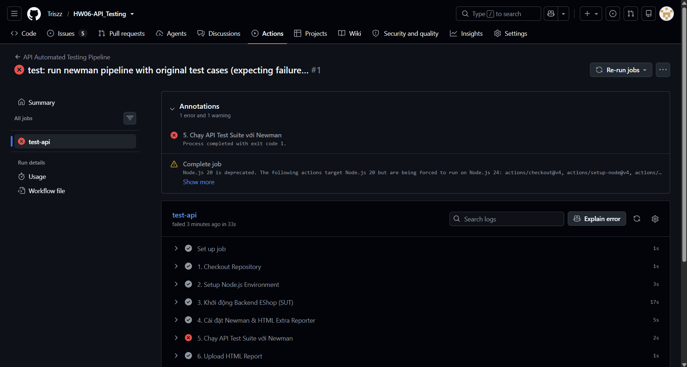
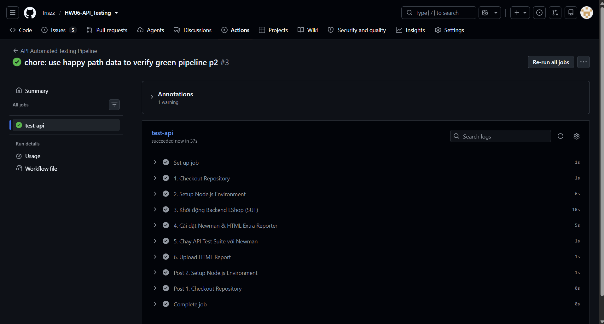

# Báo Cáo CI/CD Integration

## 1. Cấu hình Pipeline (Pipeline Configuration)

- **Nền tảng:** GitHub Actions (`ubuntu-latest`).
- **Trigger:** Tự động kích hoạt khi có sự kiện `push` lên nhánh `main`.
- **Luồng thực thi (Workflow Steps):**
  1. Checkout mã nguồn dự án.
  2. Cài đặt môi trường Node.js (v20).
  3. Truy cập thư mục `backend`, chạy `npm install` và `npm start &` để khởi động ngầm SUT (Hệ thống EShop) tại cổng 3000. Dùng `sleep 10` để đợi server sẵn sàng.
  4. Cài đặt công cụ Newman và giao diện báo cáo `newman-reporter-htmlextra` ở mức global.
  5. Thực thi bộ test bằng lệnh `newman run...` với tính năng Data-driven (đọc từ file CSV).
  6. Tự động đóng gói và lưu trữ (Upload Artifact) file báo cáo HTML để đội ngũ có thể tải về xem xét sau mỗi lần chạy.

## 2. Sample Pipeline Runs

### 2.1. Pipeline Đỏ (Failing Test Cases)

- **Mô tả:** Commit chạy bộ dữ liệu gốc `register_data.csv` (37 TCs). Do hệ thống Backend tồn tại nhiều lỗ hổng bảo mật và thiếu Validation (đã trình bày ở phần Report Bugs), các assertions bị đánh fail, dẫn đến pipeline chuyển trạng thái thất bại (Red).
- **Commit Message:** `test: run newman pipeline with original test cases (expecting failures) p2`
- **GitHub Action Link:** https://github.com/Triszz/HW06-API_Testing/actions/runs/32044293652/job/95428887514#step:6:563
- **Screenshot:**

  

### 2.2. Pipeline Xanh (All Test Cases Passing)

- **Mô tả:** Chạy luồng CI/CD với tệp cấu hình dữ liệu trích xuất `register_green.csv` (Chỉ chứa các kịch bản Happy Path - dữ liệu hợp lệ). Toàn bộ Assertions đều Passed, chứng minh quy trình CI/CD được thiết lập hoàn toàn chính xác và sẵn sàng hoạt động ổn định khi team Dev sửa xong lỗi hệ thống.
- **Commit Message:** `chore: use happy path data to verify green pipeline p2`
- **GitHub Action Link:** https://github.com/Triszz/HW06-API_Testing/actions/runs/32044759265/job/95430161803
- **Screenshot:**

  
