# BÁO CÁO HW06 - Chi tiết luồng kiểm thử API (API Testing Pipeline)

## 1. Postman Features Utilized

Trong dự án này, em đã áp dụng các tính năng sau của Postman để tối ưu hóa quá trình kiểm thử:

- **Workspaces & Collections:** Tổ chức các test cases một cách khoa học.
- **Environments & Variables:** Sử dụng biến `{{base_url}}` để linh hoạt thay đổi môi trường.
- **Pre-request Scripts:** Tự động gán Header `X-Student-Id: 23127503` cho mọi request nhằm chống gian lận.
- **Data-driven Runs (Collection Runner):** Đọc dữ liệu từ file CSV để chạy hàng loạt các test cases phân vùng tương đương.
- **Tests (Assertions):** Viết script JavaScript để verify HTTP Status, Response Time và Schema Validation.

---

## 2. API 1: Account Registration (Pool A)

- **Endpoint:** `POST /api/register`

### 2.1. Generate

- **Số lượng TCs AI sinh ra:** **30**
- **Phạm vi bao phủ:** Phân vùng tương đương, Phân tích biên (luật mật khẩu, email), Schema Validation, và Security (SQL Injection, XSS, Buffer Overflow).

### Danh sách Test Cases cho API `POST /api/register`

| TC ID                    | Test Scenario                                                                         | Request Body (JSON)                                                                                                                                                   | Expected Status                 | Expected Response                                        | Audit Status   | Audit Reason                                                                                                                                                                     |
| :----------------------- | :------------------------------------------------------------------------------------ | :-------------------------------------------------------------------------------------------------------------------------------------------------------------------- | :------------------------------ | :------------------------------------------------------- | :------------- | :------------------------------------------------------------------------------------------------------------------------------------------------------------------------------- |
| **TC_REG_01**            | Happy Path: Mọi dữ liệu hợp lệ, password vừa đúng biên 8 ký tự.                       | `{` `"name":"User A",` `"email":"valid1@domain.com",` `"password":"Password1!",` `"confirm_password":"Password1!"` `}`                                 | `200 OK`                        | `{"message":"User registered successfully","id":1}`      | **VALID**      | Kiểm tra đúng kịch bản Happy Path kết hợp giá trị biên dưới (Boundary Value) 8 ký tự của mật khẩu.                                                                               |
| **TC_REG_02**            | Happy Path: Mọi dữ liệu hợp lệ, password dài hơn 8 ký tự.                             | `{` `"name":"User B",` `"email":"valid2@domain.com",` `"password":"StrongPassword123!",` `"confirm_password":"StrongPassword123!"` `}`                 | `200 OK`                        | `{"message":"User registered successfully","id":2}`      | **VALID**      | Kiểm tra Happy Path với dữ liệu nằm giữa vùng tương đương hợp lệ (hơn 8 ký tự).                                                                                                  |
| **TC_REG_03**            | Tên (`name`) bị bỏ trống (Empty string).                                              | `{` `"name":"",` `"email":"test3@domain.com",` `"password":"Password1!",` `"confirm_password":"Password1!"` `}`                                        | `400 Bad Request`               | `{"error":"Name is required"}`                           | **VALID**      | Xác minh hệ thống bắt lỗi Schema đúng khi người dùng cố tình truyền chuỗi rỗng vào trường bắt buộc.                                                                              |
| **TC_REG_04**            | Thiếu trường `name` trong payload (Missing field).                                    | `{` `"email":"test4@domain.com",` `"password":"Password1!",` `"confirm_password":"Password1!"` `}`                                                        | `400 Bad Request`               | `{"error":"Name is required"}`                           | **VALID**      | Bao phủ kịch bản Schema Validation khi Client không gửi tham số bắt buộc.                                                                                                        |
| **TC_REG_05**            | Email bị bỏ trống (Empty string).                                                     | `{` `"name":"User C",` `"email":"",` `"password":"Password1!",` `"confirm_password":"Password1!"` `}`                                                  | `400 Bad Request`               | `{"error":"Email is required"}`                          | **VALID**      | Xác minh ràng buộc dữ liệu (Required Field) cho trường Email.                                                                                                                    |
| **TC_REG_06**            | Email sai định dạng: Thiếu ký tự `@`.                                                 | `{` `"name":"User D",` `"email":"userdomain.com",` `"password":"Password1!",` `"confirm_password":"Password1!"` `}`                                    | `400 Bad Request`               | `{"error":"Invalid email format"}`                       | **VALID**      | Kiểm tra tính đúng đắn của Regex Validation đối với định dạng Email (Vùng không hợp lệ).                                                                                         |
| **TC_REG_07**            | Email sai định dạng: Thiếu tên miền sau `@`.                                          | `{` `"name":"User E",` `"email":"user@",` `"password":"Password1!",` `"confirm_password":"Password1!"` `}`                                             | `400 Bad Request`               | `{"error":"Invalid email format"}`                       | **VALID**      | Phủ thêm ranh giới lỗi Regex của Email để đảm bảo sự chặt chẽ.                                                                                                                   |
| **TC_REG_08**            | Email sai định dạng: Thiếu phần tên trước `@`.                                        | `{` `"name":"User F",` `"email":"@domain.com",` `"password":"Password1!",` `"confirm_password":"Password1!"` `}`                                       | `400 Bad Request`               | `{"error":"Invalid email format"}`                       | **VALID**      | Phủ thêm ranh giới lỗi Regex của Email.                                                                                                                                          |
| **TC_REG_09**            | Email đã tồn tại trong hệ thống (Duplicate).                                          | `{` `"name":"User G",` `"email":"valid1@domain.com",` `"password":"Password1!",` `"confirm_password":"Password1!"` `}`                                 | `400 Bad Request`               | `{"error":"Email already exists"}`                       | **VALID**      | Bắt lỗi Business Logic: Kiểm tra ràng buộc duy nhất (Unique Constraint) trong cơ sở dữ liệu.                                                                                     |
| **TC_REG_10**            | Mật khẩu (`password`) bị bỏ trống (Empty string).                                     | `{` `"name":"User H",` `"email":"test5@domain.com",` `"password":"",` `"confirm_password":""` `}`                                                      | `400 Bad Request`               | `{"error":"Password is required"}`                       | **VALID**      | Xác minh ràng buộc dữ liệu (Required Field) cho Mật khẩu.                                                                                                                        |
| **TC_REG_11**            | Password đúng biên 7 ký tự (Invalid Boundary).                                        | `{` `"name":"User I",` `"email":"test6@domain.com",` `"password":"Pass12!",` `"confirm_password":"Pass12!"` `}`                                        | `400 Bad Request`               | `{"error":"Password must be at least 8 characters"}`     | **VALID**      | Kịch bản Phân tích giá trị biên xuất sắc (Đánh vào biên dưới - 1).                                                                                                               |
| **TC_REG_12**            | Password đủ 8 ký tự nhưng THIẾU chữ hoa.                                              | `{` `"name":"User J",` `"email":"test7@domain.com",` `"password":"password1!",` `"confirm_password":"password1!"` `}`                                  | `400 Bad Request`               | `{"error":"Password must contain uppercase letter"}`     | **VALID**      | Kiểm tra độ phức tạp của mật khẩu (Phân vùng lỗi thiếu Uppercase).                                                                                                               |
| **TC_REG_13**            | Password đủ 8 ký tự nhưng THIẾU chữ thường.                                           | `{` `"name":"User K",` `"email":"test8@domain.com",` `"password":"PASSWORD1!",` `"confirm_password":"PASSWORD1!"` `}`                                  | `400 Bad Request`               | `{"error":"Password must contain lowercase letter"}`     | **VALID**      | Kiểm tra độ phức tạp của mật khẩu (Phân vùng lỗi thiếu Lowercase).                                                                                                               |
| **TC_REG_14**            | Password đủ 8 ký tự nhưng THIẾU chữ số.                                               | `{` `"name":"User L",` `"email":"test9@domain.com",` `"password":"Password@!",` `"confirm_password":"Password@!"` `}`                                  | `400 Bad Request`               | `{"error":"Password must contain a number"}`             | **VALID**      | Kiểm tra độ phức tạp của mật khẩu (Phân vùng lỗi thiếu Numeric).                                                                                                                 |
| **TC_REG_15**            | Password đủ 8 ký tự nhưng THIẾU ký tự đặc biệt.                                       | `{` `"name":"User M",` `"email":"test10@domain.com",` `"password":"Password12",` `"confirm_password":"Password12"` `}`                                 | `400 Bad Request`               | `{"error":"Password must contain a special character"}`  | **VALID**      | Kiểm tra độ phức tạp của mật khẩu (Phân vùng lỗi thiếu Special Char).                                                                                                            |
| **TC_REG_16**            | Thiếu trường `password` trong payload.                                                | `{` `"name":"User N",` `"email":"test11@domain.com",` `"confirm_password":"Password1!"` `}`                                                               | `400 Bad Request`               | `{"error":"Password is required"}`                       | **VALID**      | Schema Validation - Missing field.                                                                                                                                               |
| **TC_REG_17**            | `confirm_password` bị bỏ trống.                                                       | `{` `"name":"User O",` `"email":"test12@domain.com",` `"password":"Password1!",` `"confirm_password":""` `}`                                           | `400 Bad Request`               | `{"error":"Confirm password is required"}`               | **VALID**      | Schema Validation cho trường xác nhận mật khẩu.                                                                                                                                  |
| **TC_REG_18**            | `confirm_password` không khớp: Sai chữ hoa/thường.                                    | `{` `"name":"User P",` `"email":"test13@domain.com",` `"password":"Password1!",` `"confirm_password":"password1!"` `}`                                 | `400 Bad Request`               | `{"error":"Passwords do not match"}`                     | **VALID**      | Kiểm tra Logic so sánh Case-Sensitive.                                                                                                                                           |
| **TC_REG_19**            | `confirm_password` không khớp: Hoàn toàn khác biệt.                                   | `{` `"name":"User Q",` `"email":"test14@domain.com",` `"password":"Password1!",` `"confirm_password":"AnotherPassword1!"` `}`                          | `400 Bad Request`               | `{"error":"Passwords do not match"}`                     | **VALID**      | Kiểm tra Logic so sánh dữ liệu.                                                                                                                                                  |
| **TC_REG_20**            | Loại dữ liệu sai (Data type mismatch): Số thay vì chuỗi.                              | `{` `"name":123,` `"email":"test15@domain.com",` `"password":"Password1!",` `"confirm_password":"Password1!"` `}`                                      | `400 Bad Request`               | `{"error":"Invalid data type"}`                          | **INCOMPLETE** | AI mới chỉ test data type cho trường `name`. Cần phải tạo thêm các test case truyền số/boolean vào trường `email` và `password` để đảm bảo độ phủ 100%.                          |
| **TC_REG_21**            | Security (SQLi): SQL Injection cơ bản vào trường `email`.                             | `{` `"name":"User A",` `"email":"admin@domain.com' OR 1=1 --",` `"password":"Password1!",` `"confirm_password":"Password1!"` `}`                       | `400 Bad Request`               | `{"error":"Invalid email format"}`                       | **VALID**      | Bao phủ tốt kịch bản tấn công SQL Injection cơ bản vào Input.                                                                                                                    |
| **TC_REG_22**            | Security (SQLi): SQL Injection thời gian (Time-based) vào `email`.                    | `{` `"name":"User B",` `"email":"test@...'; WAITFOR DELAY '0:0:5'--",` `"password":"Password1!",` `"confirm_password":"Password1!"` `}`                | `400 Bad Request`               | `{"error":"Invalid email format"}`                       | **VALID**      | Khai thác lỗ hổng Blind SQL Injection nâng cao.                                                                                                                                  |
| **TC_REG_23**            | Security (XSS): Chèn mã script độc hại vào trường `name`.                             | `{` `"name":"",` `"email":"xss@domain.com",` `"password":"Password1!",` `"confirm_password":"Password1!"` `}`             | `400 Bad Request`               | `{"error":"Invalid characters in name"}`                 | **VALID**      | Kiểm tra khả năng Sanitize mã HTML của server, phòng chống Stored XSS.                                                                                                           |
| **TC_REG_24**            | Security: Chuỗi siêu dài (>1000 ký tự) gây Buffer Overflow vào `name`.                | `{` `"name":"A... (lặp 1000 chữ A)",` `"email":"buffer@domain.com",` `"password":"Password1!",` `"confirm_password":"Password1!"` `}`                  | `400 Bad Request`               | `{"error":"Name exceeds maximum length"}`                | **VALID**      | Đánh giá độ chịu tải cấu trúc (Buffer Size) của cơ sở dữ liệu.                                                                                                                   |
| **TC_REG_25**            | Security: Đổi HTTP Method từ POST sang GET.                                           | `{}`                                                                                                                                                                  | `405 Method Not Allowed`        | `{"error":"Method Not Allowed"}`                         | **VALID**      | Kiểm thử định tuyến Route của Server chống tấn công Override Method.                                                                                                             |
| **TC_REG_26**            | Schema: Header Content-Type là `text/plain` thay vì `application/json`.               | `{` `"name":"User C",` `"email":"text@domain.com",` `"password":"Password1!",` `"confirm_password":"Password1!"` `}`                                   | `415 Unsupported Media Type`    | `{"error":"Unsupported Media Type"}`                     | **VALID**      | Bắt lỗi Header sai định dạng.                                                                                                                                                    |
| **TC_REG_27**            | Schema (Malformed JSON): Thiếu dấu phẩy ngăn cách các trường.                         | `{` `"name":"User D" "email":"json@...",` `"password":"Password1!",` `"confirm_password":"Password1!"` `}`                                                | `400 Bad Request`               | `{"error":"Invalid JSON payload"}`                       | **VALID**      | Thử thách công cụ Parser nội bộ của Node.js.                                                                                                                                     |
| **TC_REG_28**            | Schema (Malformed JSON): Thiếu dấu ngoặc nhọn đóng `}` ở cuối.                        | `{` `"name":"User E",` `"email":"json2@...",` `"password":"Password1!",` `"confirm_password":"Password1!"`                                             | `400 Bad Request`               | `{"error":"Invalid JSON payload"}`                       | **INVALID**    | AI viết sai vì Postman sẽ báo lỗi "Syntax Error" ngay tại giao diện và chặn không cho gửi đi. Để gửi được request này, QA phải chỉnh chế độ Body sang "Raw Text" thay vì "JSON". |
| **TC_REG_29**            | Schema: Gửi payload rỗng (Empty body).                                                | `{}`                                                                                                                                                                  | `400 Bad Request`               | `{"error":"Name, email, and password are required"}`     | **VALID**      | Phủ trường hợp thiếu toàn bộ các tham số bắt buộc.                                                                                                                               |
| **TC_REG_30**            | Schema: Gửi các trường (fields) không tồn tại (Extra properties).                     | `{` `"name":"User F",` `"email":"extra@domain.com",` `"password":"Password1!",` `"confirm_password":"Password1!",` `"role": "ADMIN"` `}`            | `400 Bad Request`               | Phụ thuộc SUT                                            | **VALID**      | Case này rất hay để kiểm tra lỗ hổng Mass Assignment (chiếm quyền bằng cách tự inject trường phân quyền).                                                                        |
| **TC_REG_31 (Extended)** | **Security (Rate Limiting):** Gửi liên tục 50 requests đăng ký trong vòng 1 giây.     | `{` `"name":"Spammer",` `"email":"spam_limit@domain.com",` `"password":"Password1!",` `"confirm_password":"Password1!"` `}`   _(Thực thi liên tục)_ | `429 Too Many Requests`         | `{"error":"Too many requests. Please try again later."}` | **VALID**      | Tự viết thêm do AI thiếu tư duy về hạ tầng mạng và cơ chế chống Spam/DDoS.                                                                                                       |
| **TC_REG_32 (Extended)** | **Security (Password Trimming):** Thêm khoảng trắng (space) vào đầu và cuối mật khẩu. | `{` `"name":"User Space",` `"email":"space@domain.com",` `"password":" Password1! ",` `"confirm_password":" Password1! "` `}`                          | `200 OK` hoặc `400 Bad Request` | `{"message":"User registered successfully"}` hoặc Error  | **VALID**      | Tự viết thêm vì AI hiểu máy móc theo regex mà không tính đến hành vi copy/paste bị dính khoảng trắng của người dùng thật.                                                        |
| **TC_REG_33 (Extended)** | **Functional (Unicode/Emoji):** Tên người dùng chứa Tiếng Việt có dấu và Emoji.       | `{` `"name":"Nguyễn Văn 🤖",` `"email":"unicode@domain.com",` `"password":"Password1!",` `"confirm_password":"Password1!"` `}`                         | `200 OK`                        | `{"message":"User registered successfully","id":...}`    | **VALID**      | Tự viết thêm để kiểm tra khả năng lưu trữ ký tự đặc biệt (chuẩn UTF-8) của Database.                                                                                             |
| **TC_REG_34 (Extended)** | **Security (Validation Bypass):** Thêm khoảng trắng vào cuối email đã tồn tại.        | `{` `"name":"Hacker",` `"email":"admin@domain.com  ",` `"password":"Password1!",` `"confirm_password":"Password1!"` `}`                                | `400 Bad Request`               | `{"error":"Email already exists"}`                       | **VALID**      | Tự viết thêm để xem hệ thống có trim() khoảng trắng trước khi check trùng lặp (duplicate) dưới CSDL hay không.                                                                   |
| **TC_REG_35 (Extended)** | **State Transition:** Đăng ký thành công, sau đó gửi lại chính xác payload đó lần 2.  | `{` `"name":"User State",` `"email":"state@domain.com",` `"password":"Password1!",` `"confirm_password":"Password1!"` `}`                              | `400 Bad Request`               | `{"error":"Email already exists"}`                       | **VALID**      | Tự viết thêm để kiểm tra sự chuyển đổi trạng thái của email từ "Có thể đăng ký" sang "Đã tồn tại".                                                                               |
| **TC_REG_36 (Extended)** | **Schema (Data type mismatch):** Truyền số (Number) thay vì chuỗi vào trường `email`. | `{` `"name":"User R",` `"email":456,` `"password":"Password1!",` `"confirm_password":"Password1!"` `}`                                                 | `400 Bad Request`               | `{"error":"Invalid data type"}`                          | **VALID**      | Tự bổ sung để vá lỗ hổng INCOMPLETE của AI tại `TC_REG_20`.                                                                                                                      |
| **TC_REG_37 (Extended)** | **Schema (Data type mismatch):** Truyền Boolean thay vì chuỗi vào trường `password`.  | `{` `"name":"User S",` `"email":"test16@domain.com",` `"password":true,` `"confirm_password":true` `}`                                                 | `400 Bad Request`               | `{"error":"Invalid data type"}`                          | **VALID**      | Tự bổ sung để vá lỗ hổng INCOMPLETE của AI tại `TC_REG_20`.                                                                                                                      |

### 2.2. Audit (Human Review)

- **Tóm tắt:** Đã đánh giá 30 test cases do AI sinh ra. Kết quả: **28 VALID**, **1 INVALID**, **1 INCOMPLETE**.
- **Lý do sửa đổi và đánh giá AI:**
  - **TC_REG_28 (INVALID):** AI thiết kế case kiểm tra Schema bằng cách gửi JSON thiếu dấu ngoặc nhọn `}`. Tuy ý tưởng đúng, nhưng AI không hiểu cơ chế của tool: Postman sẽ báo lỗi "Syntax Error" ngay trên UI và chặn không cho gửi request đi nếu để chế độ body là `application/json`. _Cách sửa:_ Tôi phải can thiệp bằng cách chuyển chế độ gửi trong Postman sang `Raw Text` để có thể ép server nhận payload lỗi này.
  - **TC_REG_20 (INCOMPLETE):** AI thiết kế case kiểm tra sai kiểu dữ liệu (Data type mismatch) bằng cách truyền số `123` vào trường `name`, nhưng lại dừng ở đó. AI quên không tạo các case tương tự để test việc truyền số/boolean vào trường `email` và `password`. Tôi phải ghi chú lại để tự cover nhằm đảm bảo độ phủ 100%.

### 2.3. Extend

- **Số lượng TCs tự viết thêm:** **7** (Từ TC_REG_31 đến TC_REG_37)
- **Chi tiết các case (Lấp lỗ hổng của AI):**
  - **Security (Rate Limiting - TC_REG_31):** AI chỉ tập trung vào bảo mật Payload (SQLi, XSS) mà thiếu tư duy về hạ tầng mạng. Tôi đã bổ sung case bắn liên tục 50 requests/giây để kiểm tra cơ chế phòng chống Spam/DDoS của API đăng ký.
  - **Security & Validation Bypass (TC_REG_32 & TC_REG_34):** AI xử lý validation một cách máy móc theo chuẩn Regex mà không lường trước hành vi người dùng thực tế (copy/paste bị dính khoảng trắng). Tôi đã thêm case cố tình chèn space vào mật khẩu (`" Password1! "`) và email (`"admin@domain.com  "`) để kiểm tra xem hệ thống có thực hiện hàm `trim()` hay không, qua đó chặn các rủi ro bypass logic kiểm tra trùng lặp.
  - **State Transitions (TC_REG_35):** AI có tạo case test email trùng lặp (TC*REG_09), nhưng đó chỉ là test dữ liệu tĩnh. Tôi đã bổ sung case mang tính chất chuyển trạng thái (State Lifecycle): Đăng ký thành công một user hợp lệ, sau đó \_ngay lập tức* gửi lại đúng payload đó lần thứ hai. Hệ thống phải nhận diện được sự thay đổi trạng thái của email từ "Có thể đăng ký" sang "Đã tồn tại" và từ chối request.
  - **Functional Unicode (TC_REG_33):** Bổ sung test case có chứa ký tự Tiếng Việt có dấu và Emoji (`"Nguyễn Văn 🤖"`) để kiểm thử khả năng hỗ trợ mã hóa UTF-8 ở tầng Database mà AI hoàn toàn bỏ quên.
  - **Schema Data Type (TC_REG_36 & TC_REG_37):** Đã bổ sung các case truyền số (Number) và Boolean vào trường email và password để hoàn thiện sự thiếu sót (INCOMPLETE) của AI ở TC_REG_20, đảm bảo độ phủ 100% về kiểm tra kiểu dữ liệu cho toàn bộ các trường bắt buộc.

---

### 2.4. Execute

Quá trình thực thi kiểm thử (Execution) cho API Đăng ký tài khoản (`POST /api/register`) được tự động hóa hoàn toàn thông qua phương pháp **Data-driven Testing**, chi tiết như sau:

- **Công cụ thực thi:**
  - **Postman Collection Runner:** Được sử dụng ở giai đoạn đầu để debug, kiểm tra logic script và đảm bảo các biến chạy đúng kịch bản.
  - **Newman CLI:** Được sử dụng để chạy chính thức toàn bộ kịch bản và xuất báo cáo dưới dạng giao diện web trực quan. Lệnh thực thi:
    `newman run HW06_API_Test_Suite.postman_collection.json -e "EShop - Local Environment.postman_environment.json" -d register_data.csv -r htmlextra`
- **Dữ liệu đầu vào:** File `register_data.csv` chứa 37 iterations, tương ứng với 37 Test Cases đã thiết kế (Bao gồm AI-generated và Human-extended).
- **Cơ chế Anti-Cheat:** Đã cấu hình thành công _Pre-request Script_ ở cấp độ Collection. Hệ thống tự động can thiệp và đính kèm Header `X-Student-Id: 23127503` vào toàn bộ 37 requests được gửi đi (Bằng chứng được lưu tại console log và báo cáo HTML).
- **Kết quả:** Quá trình chạy diễn ra thông suốt. Tuy nhiên, tỷ lệ Test Cases FAILED chiếm phần lớn. Phân tích đối chiếu log cho thấy **kịch bản test hoàn toàn chính xác**, sự thất bại của các assertions đến từ việc hệ thống SUT (System Under Test) hoạt động sai lệch nghiêm trọng so với đặc tả (API không có cơ chế bảo vệ), dẫn đến việc phát hiện 5 Bugs chí mạng.

---

### 2.5. Report Bugs

Dưới đây là danh sách 5 lỗi (Bugs) nghiêm trọng được bóc tách từ việc phân tích kỹ lưỡng file log (Console) và báo cáo Newman HTML. Các lỗi này đã được ghi nhận (Log) chính thức lên hệ thống GitHub Issues.

### 1. [Critical] SUT rò rỉ thông tin hệ thống (Information Disclosure / Stack Trace Leak)

- **Mức độ (Severity):** **CRITICAL**

- **Phân loại (Category):** **Security** (Information Exposure)

- **Mô tả chi tiết:** Khi người dùng gửi một payload JSON bị sai cú pháp (thiếu dấu ngoặc nhọn `}` ở cuối), thay vì bắt lỗi và trả về mã `400 Bad Request`, máy chủ (Express.js) lại không thể xử lý, dẫn đến crash nội bộ và trả về một trang HTML chứa toàn bộ Stack Trace báo lỗi. Lỗi này được phát hiện ở `TC_REG_28`.

- **Tác động (Impact):** Cực kỳ nguy hiểm. Hệ thống đã vô tình phơi bày đường dẫn tuyệt đối trên máy chủ của hệ thống (`D:\Software Testing\Seminar\eshop-sut\backend\node_modules\...`) cùng các thư viện đang sử dụng. Kẻ tấn công có thể dựa vào thông tin kiến trúc này để dò quét và khai thác các lỗ hổng sâu hơn.

- **GitHub Issue Link:** https://github.com/Triszz/HW06-API_Testing/issues/1

- **Ảnh chụp (Screenshot):**

  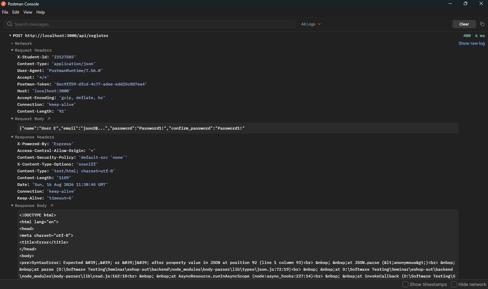

### 2. [Critical Security] Lỗ hổng bảo mật: Nhận mã độc XSS và Mass Assignment

- **Mức độ (Severity):** **CRITICAL (Security)**

- **Phân loại (Category):** **Security** (Injection & Broken Access Control)

- **Mô tả chi tiết:** Backend API hoàn toàn không thực hiện mã hóa (encode) hay thanh lọc (sanitize) dữ liệu đầu vào. Cụ thể:
  - Ở `TC_REG_23`, hệ thống chấp nhận chuỗi chứa mã độc HTML/JS `` vào trường `name` và trả về `200 OK`.

  - Ở `TC_REG_30`, khi cố tình truyền thêm trường phân quyền `"role": "ADMIN"`, hệ thống cũng lưu trữ thành công mà không loại bỏ các trường thừa (Mass Assignment).

- **Tác động (Impact):** Lỗ hổng Stored XSS cho phép hacker chèn mã độc vào tên, khi Admin truy cập xem danh sách User, mã độc sẽ thực thi và đánh cắp Session/Cookie của Admin. Lỗ hổng Mass Assignment cho phép người dùng tự do thăng cấp tài khoản của mình lên làm Quản trị viên để chiếm quyền hệ thống.

- **GitHub Issue Link:** https://github.com/Triszz/HW06-API_Testing/issues/2

- **Ảnh chụp (Screenshot):**

  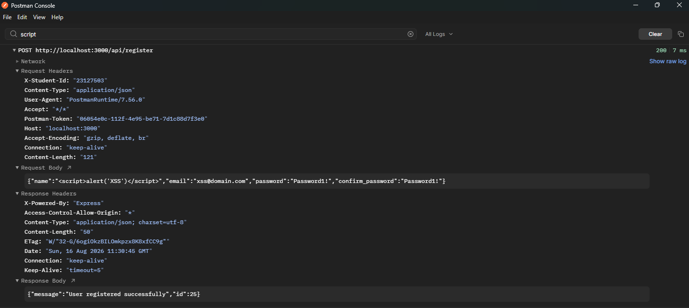

### 3. [Major] Lỗi Logic Nghiệp Vụ: Bỏ qua kiểm tra khớp Mật khẩu (Password Mismatch Ignored)

- **Mức độ (Severity):** **MAJOR**

- **Phân loại (Category):** **Functional** (Business Logic)

- **Mô tả chi tiết:** Lập trình viên thiết kế trường `confirm_password` ở phía Client nhưng lại không có code xử lý so sánh với trường `password` ở phía Server. Ở `TC_REG_19`, dù mật khẩu xác nhận được gửi lên là `"AnotherPassword1!"` (khác biệt hoàn toàn với mật khẩu gốc), hệ thống vẫn bỏ qua và trả về `200 OK`.

- **Tác động (Impact):** Gây rủi ro nghiêm trọng về trải nghiệm người dùng (UX). Nếu người dùng gõ nhầm mật khẩu ở ô đầu tiên, họ sẽ không hề hay biết và sau này bị mất quyền truy cập (không thể đăng nhập lại vào tài khoản vừa tạo).

- **GitHub Issue Link:** https://github.com/Triszz/HW06-API_Testing/issues/3

- **Ảnh chụp (Screenshot):**

  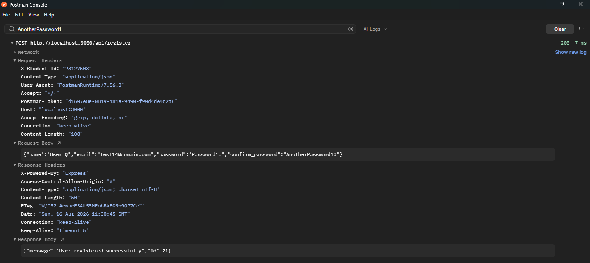

### 4. [Major] Lỗi Logic Nghiệp Vụ: Cho phép đăng ký trùng Email (Duplicate Email)

- **Mức độ (Severity):** **MAJOR**

- **Phân loại (Category):** **Functional** (Data Integrity)

- **Mô tả chi tiết:** API thiếu khâu truy vấn kiểm tra dữ liệu tồn tại (Unique Constraint) trong Database. Ở request `TC_REG_01`, tài khoản với email `valid1@domain.com` được tạo thành công với ID là `3`. Tuy nhiên, khi gửi lại đúng email này ở `TC_REG_09`, hệ thống vẫn tiếp nhận và tạo ra một tài khoản mới tinh với ID là `11`.

- **Tác động (Impact):** Logic định danh (Identity) của toàn bộ hệ thống bị phá vỡ. Cơ sở dữ liệu sẽ chứa nhiều bản ghi trùng lặp email, dẫn đến việc chức năng Đăng nhập hoặc Quên mật khẩu phía sau không thể hoạt động chính xác vì không biết phải trỏ về User ID nào.

- **GitHub Issue Link:** https://github.com/Triszz/HW06-API_Testing/issues/4

- **Ảnh chụp (Screenshot):**

  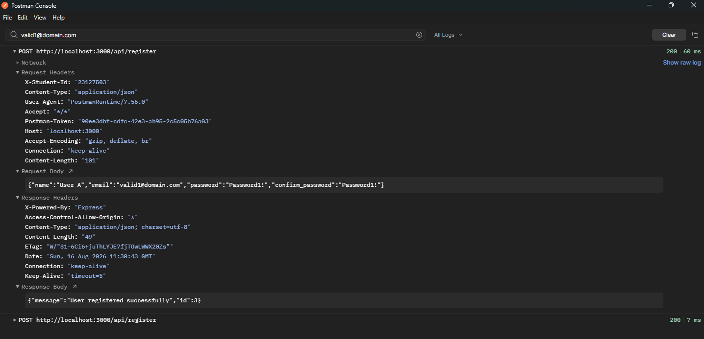

  
<i>Tài khoản với email <code>valid1@domain.com</code> được tạo thành công lần 1</i>

   

  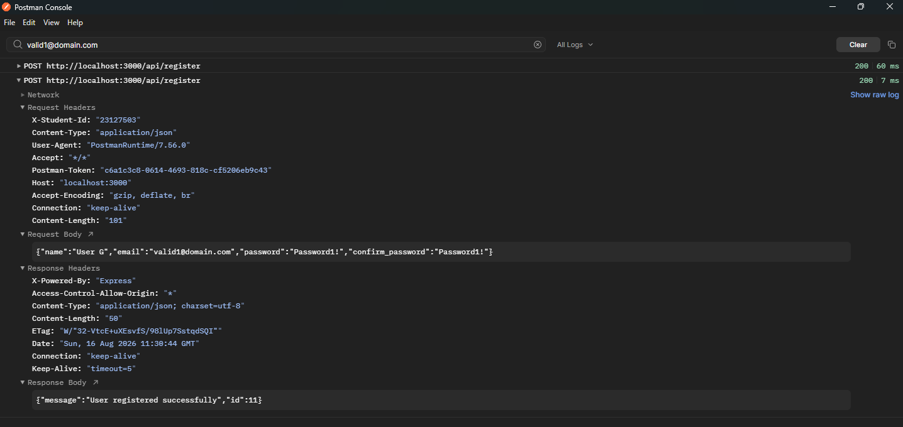

   
<i>Tài khoản với email <code>valid1@domain.com</code> được tạo thành công lần 2</i>

### 5. [Major] Thiếu hoàn toàn Data Validation (No Input Validation)

- **Mức độ (Severity):** **MAJOR**

- **Phân loại (Category):** **Functional** (Input Validation)

- **Mô tả chi tiết:** Server không có bất kỳ bộ kiểm tra ràng buộc (Validator) nào cho các trường đầu vào. Hệ thống dễ dàng trả về `200 OK` cho các kịch bản:
  - Payload rỗng hoàn toàn `{}` (`TC_REG_29`).

  - Email sai định dạng, thiếu tên miền hoặc thiếu ký tự `@` (`TC_REG_06`, `TC_REG_07`, `TC_REG_08`).

  - Mật khẩu yếu, rỗng hoặc thiếu các ký tự đặc biệt theo quy định (`TC_REG_10` đến `TC_REG_15`).

  - Truyền sai kiểu dữ liệu thành số nguyên hoặc boolean (`TC_REG_36`, `TC_REG_37`).

- **Tác động (Impact):** Dữ liệu rác (Garbage Data) tràn ngập trong cơ sở dữ liệu. Các dịch vụ nghiệp vụ phía sau (VD: Dịch vụ gửi Email tự động, Dịch vụ thanh toán) khi đọc phải các dữ liệu sai cấu trúc này sẽ gặp lỗi và có nguy cơ sập toàn bộ hệ thống (System Failure).

- **GitHub Issue Link:** https://github.com/Triszz/HW06-API_Testing/issues/5

- **Ảnh chụp (Screenshot):**

  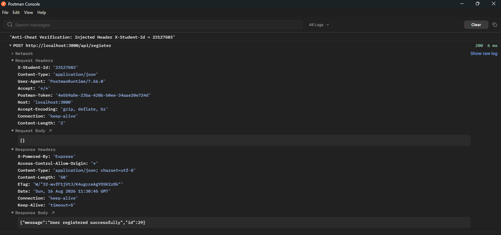

   
<i>Tài khoản với payload rỗng <code>{}</code> được tạo thành công</i>

   

  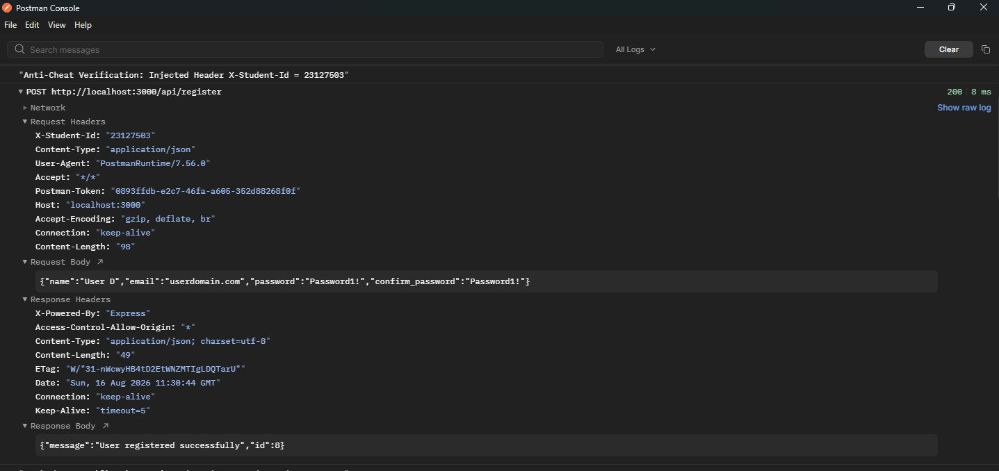

   
<i>Tài khoản với email sai định dạng (thiếu <code>@</code>) được tạo thành công</i>

   

  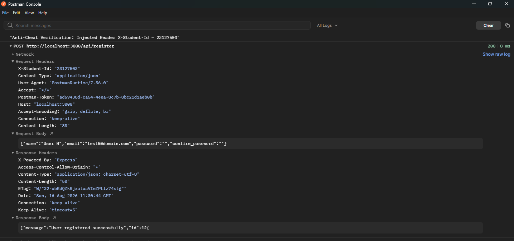

   
<i>Tài khoản với mật khẩu rỗng được tạo thành công</i>

   

  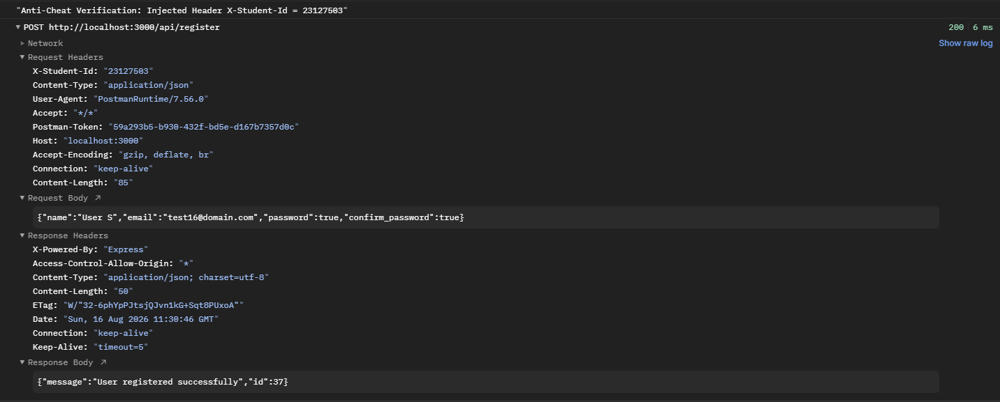

  
<i>Tài khoản với mật khẩu là kiểu dữ liệu boolean được tạo thành công</i>

---

## 3. API 2: Apply Coupon (Pool B)

- **Endpoint:** `POST /api/apply-coupon`

### 3.1. Generate

- **Số lượng TCs AI sinh ra:** **35**
- **Phạm vi bao phủ:** Decision Table (Bảng quyết định cho 5 điều kiện coupon), Toán học (Tính toán phần trăm/giá trị tĩnh), Phân tích biên (ngưỡng giá tối thiểu), Schema Validation và Security (IDOR, Broken Authentication).

### Danh sách Test Cases cho API `POST /api/apply-coupon`

| TC ID                     | Test Scenario                                                                                                                 | Request Body (JSON)                                                                                               | Expected Status         | Expected Response                                                                    | Audit Status | Audit Reason                                                                                                                                                                                      |
| :------------------------ | :---------------------------------------------------------------------------------------------------------------------------- | :---------------------------------------------------------------------------------------------------------------- | :---------------------- | :----------------------------------------------------------------------------------- | :----------- | :------------------------------------------------------------------------------------------------------------------------------------------------------------------------------------------------ |
| **TC_COUPON_01**          | Happy Path (Percent): Mọi điều kiện hợp lệ. Dùng mã `SAVE10` với đơn 500k. (Giảm 10%).                                        | `{` `"code": "SAVE10",` `"total_amount": 500000,` `"user_id": 1` `}`                                  | `200 OK`                | `{"discount_amount": 50000, "final_amount": 450000}`                                 | **VALID**    | Tính toán phần trăm (10% của 500,000 là 50,000) và thỏa mãn mọi điều kiện (C1-C5) hoàn toàn chính xác.                                                                                            |
| **TC_COUPON_02**          | Happy Path (Fixed): Mọi điều kiện hợp lệ. Dùng mã `VIP100` với đơn 400k. (Giảm 100k).                                         | `{` `"code": "VIP100",` `"total_amount": 400000,` `"user_id": 2` `}`                                  | `200 OK`                | `{"discount_amount": 100000, "final_amount": 300000}`                                | **VALID**    | Phép trừ cố định (400,000 - 100,000) và điều kiện hợp lệ.                                                                                                                                         |
| **TC_COUPON_03**          | Boundary (C3=True): Đơn hàng vừa đúng ngưỡng tối thiểu 300k với mã `SAVE10`.                                                  | `{` `"code": "SAVE10",` `"total_amount": 300000,` `"user_id": 3` `}`                                  | `200 OK`                | `{"discount_amount": 30000, "final_amount": 270000}`                                 | **VALID**    | Áp dụng đúng ranh giới ngưỡng dưới (Boundary Value) của điều kiện C3. Phép tính đúng.                                                                                                             |
| **TC_COUPON_04**          | Happy Path (Fixed): Dùng mã `BIGBUY` với đơn đúng ngưỡng 500k.                                                                | `{` `"code": "BIGBUY",` `"total_amount": 500000,` `"user_id": 4` `}`                                  | `200 OK`                | `{"discount_amount": 50000, "final_amount": 450000}`                                 | **VALID**    | Kiểm thử thành công ngưỡng biên C3 cho mã `BIGBUY`.                                                                                                                                               |
| **TC_COUPON_05**          | Vi phạm C1: Mã giảm giá không tồn tại hoặc đã bị vô hiệu hóa (is_active = 0).                                                 | `{` `"code": "NOTFOUND",` `"total_amount": 500000,` `"user_id": 1` `}`                                | `400 Bad Request`       | `{"error": "Coupon code does not exist or is inactive"}`                             | **VALID**    | Phủ sóng lỗi mã không tồn tại theo bảng quyết định.                                                                                                                                               |
| **TC_COUPON_06**          | Vi phạm C2: Mã giảm giá đã hết hạn (Dùng mã `EXPIRED`).                                                                       | `{` `"code": "EXPIRED",` `"total_amount": 500000,` `"user_id": 1` `}`                                 | `400 Bad Request`       | `{"error": "Coupon code has expired"}`                                               | **VALID**    | Xử lý đúng kịch bản vi phạm C2.                                                                                                                                                                   |
| **TC_COUPON_07**          | Vi phạm C3 (Boundary): Đơn hàng thiếu 1 VNĐ so với ngưỡng tối thiểu (299,999 đ) của `SAVE10`.                                 | `{` `"code": "SAVE10",` `"total_amount": 299999,` `"user_id": 5` `}`                                  | `400 Bad Request`       | `{"error": "Total amount does not meet the minimum requirement"}`                    | **VALID**    | Phân tích biên tiêu cực xuất sắc (Ngưỡng dưới - 1).                                                                                                                                               |
| **TC_COUPON_08**          | Vi phạm C3: Đơn hàng không đủ ngưỡng tối thiểu cho `BIGBUY` (499,999 đ).                                                      | `{` `"code": "BIGBUY",` `"total_amount": 499999,` `"user_id": 6` `}`                                  | `400 Bad Request`       | `{"error": "Total amount does not meet the minimum requirement"}`                    | **VALID**    | Phân tích biên tiêu cực xuất sắc.                                                                                                                                                                 |
| **TC_COUPON_09**          | Vi phạm C5: User đã sử dụng mã `SAVE10` 1 lần trước đó (Vượt giới hạn max_use = 1).                                           | `{` `"code": "SAVE10",` `"total_amount": 500000,` `"user_id": 99` `}`                                 | `400 Bad Request`       | `{"error": "Coupon usage limit exceeded for this user"}`                             | **VALID**    | Kiểm thử giới hạn sử dụng C5.                                                                                                                                                                     |
| **TC_COUPON_10**          | Trạng thái C5 hợp lệ: User dùng mã `VIP100` lần thứ 2 (Ngưỡng max_use = 2).                                                   | `{` `"code": "VIP100",` `"total_amount": 300000,` `"user_id": 7` `}`                                  | `200 OK`                | `{"discount_amount": 100000, "final_amount": 200000}`                                | **VALID**    | Kiểm thử điểm biên tối đa của C5.                                                                                                                                                                 |
| **TC_COUPON_11**          | Vi phạm C5: User cố gắng dùng mã `VIP100` lần thứ 3 (Vượt giới hạn max_use = 2).                                              | `{` `"code": "VIP100",` `"total_amount": 400000,` `"user_id": 7` `}`                                  | `400 Bad Request`       | `{"error": "Coupon usage limit exceeded for this user"}`                             | **VALID**    | Kiểm thử vượt biên C5.                                                                                                                                                                            |
| **TC_COUPON_12**          | Vi phạm C4: Không gửi JWT Token hợp lệ trên Header (Lỗi Xác thực).                                                            | `{` `"code": "SAVE10",` `"total_amount": 500000,` `"user_id": 1` `}`                                  | `401 Unauthorized`      | `{"error": "Invalid or missing authentication token"}`                               | **VALID**    | Xử lý kịch bản thiếu xác thực (C4). Cần dùng Script để loại bỏ token khi chạy.                                                                                                                    |
| **TC_COUPON_13**          | Tổ hợp vi phạm (C2 + C3): Mã vừa hết hạn, đơn hàng vừa không đủ ngưỡng.                                                       | `{` `"code": "EXPIRED",` `"total_amount": 50000,` `"user_id": 8` `}`                                  | `400 Bad Request`       | `{"error": "Coupon code has expired"}`                                               | **VALID**    | Kiểm thử tổ hợp điều kiện để xem Backend ưu tiên ném lỗi nào trước.                                                                                                                               |
| **TC_COUPON_14**          | Tổ hợp vi phạm (C1 + C3): Mã không tồn tại và đơn giá siêu thấp (10k).                                                        | `{` `"code": "INVALID",` `"total_amount": 10000,` `"user_id": 9` `}`                                  | `400 Bad Request`       | `{"error": "Coupon code does not exist or is inactive"}`                             | **VALID**    | Tổ hợp điều kiện theo bảng quyết định.                                                                                                                                                            |
| **TC_COUPON_15**          | Tổ hợp vi phạm (C3 + C5): Đơn hàng không đủ tiền và user đã vượt lượt dùng.                                                   | `{` `"code": "SAVE10",` `"total_amount": 200000,` `"user_id": 99` `}`                                 | `400 Bad Request`       | Phụ thuộc vào thứ tự xử lý của Backend (Có thể trả về lỗi Threshold hoặc lỗi Limit). | **VALID**    | Tổ hợp điều kiện hợp lý.                                                                                                                                                                          |
| **TC_COUPON_16**          | Boundary (Negative): `total_amount` bằng 0.                                                                                   | `{` `"code": "SAVE10",` `"total_amount": 0,` `"user_id": 15` `}`                                      | `400 Bad Request`       | `{"error": "Total amount must be greater than 0"}`                                   | **VALID**    | Phát hiện sau đánh giá Prompt 1. Bổ sung biên ranh giới `0` cực kỳ quan trọng cho dữ liệu tiền tệ.                                                                                                |
| **TC_COUPON_17**          | Boundary (Negative): `total_amount` là số âm.                                                                                 | `{` `"code": "SAVE10",` `"total_amount": -500000,` `"user_id": 15` `}`                                | `400 Bad Request`       | `{"error": "Total amount must be a positive number"}`                                | **VALID**    | Phát hiện giá trị âm. Phủ sóng hoàn hảo Boundary cho `total_amount`.                                                                                                                              |
| **TC_COUPON_18**          | Boundary (Negative): `total_amount` siêu lớn gây tràn bộ nhớ (Buffer Overflow).                                               | `{` `"code": "SAVE10",` `"total_amount": 999999999999999,` `"user_id": 15` `}`                        | `400 Bad Request`       | `{"error": "Total amount exceeds maximum allowed limit"}`                            | **VALID**    | Test case Buffer Overflow cho cấu trúc Integer của DB.                                                                                                                                            |
| **TC_COUPON_19**          | Schema: Bỏ trống trường `code` (Missing field).                                                                               | `{` `"total_amount": 500000,` `"user_id": 15` `}`                                                        | `400 Bad Request`       | `{"error": "Coupon code is required"}`                                               | **VALID**    | Test Schema Validation.                                                                                                                                                                           |
| **TC_COUPON_20**          | Schema: Bỏ trống trường `total_amount` (Missing field).                                                                       | `{` `"code": "SAVE10",` `"user_id": 15` `}`                                                              | `400 Bad Request`       | `{"error": "Total amount is required"}`                                              | **VALID**    | Test Schema Validation.                                                                                                                                                                           |
| **TC_COUPON_21**          | Schema: Bỏ trống trường `user_id` (Missing field).                                                                            | `{` `"code": "SAVE10",` `"total_amount": 500000` `}`                                                     | `400 Bad Request`       | `{"error": "User ID is required"}`                                                   | **VALID**    | Test Schema Validation.                                                                                                                                                                           |
| **TC_COUPON_22**          | Schema: Gửi payload rỗng (Empty body).                                                                                        | `{}`                                                                                                              | `400 Bad Request`       | `{"error": "Code, total_amount, and user_id are required"}`                          | **VALID**    | Test Schema Validation toàn diện.                                                                                                                                                                 |
| **TC_COUPON_23**          | Schema: `total_amount` truyền dạng chuỗi String thay vì Number.                                                               | `{` `"code": "SAVE10",` `"total_amount": "500000",` `"user_id": 15` `}`                               | `400 Bad Request`       | `{"error": "Invalid data type for total_amount"}`                                    | **VALID**    | Bắt lỗi Type mismatch.                                                                                                                                                                            |
| **TC_COUPON_24**          | Schema: `total_amount` truyền kiểu Boolean.                                                                                   | `{` `"code": "SAVE10",` `"total_amount": true,` `"user_id": 15` `}`                                   | `400 Bad Request`       | `{"error": "Invalid data type for total_amount"}`                                    | **VALID**    | Bắt lỗi Type mismatch.                                                                                                                                                                            |
| **TC_COUPON_25**          | Schema: `total_amount` truyền giá trị Null.                                                                                   | `{` `"code": "SAVE10",` `"total_amount": null,` `"user_id": 15` `}`                                   | `400 Bad Request`       | `{"error": "Total amount cannot be null"}`                                           | **VALID**    | Tránh lỗi Null Pointer Exception ở server.                                                                                                                                                        |
| **TC_COUPON_26**          | Schema: `user_id` truyền dạng chuỗi String thay vì Number.                                                                    | `{` `"code": "SAVE10",` `"total_amount": 500000,` `"user_id": "15"` `}`                               | `400 Bad Request`       | `{"error": "Invalid data type for user_id"}`                                         | **VALID**    | Type mismatch trên ID.                                                                                                                                                                            |
| **TC_COUPON_27**          | Schema: `user_id` truyền số thập phân (Float/Decimal).                                                                        | `{` `"code": "SAVE10",` `"total_amount": 500000,` `"user_id": 1.5` `}`                                | `400 Bad Request`       | `{"error": "User ID must be an integer"}`                                            | **VALID**    | ID trong CSDL thường là Integer, gửi float sẽ lỗi truy vấn.                                                                                                                                       |
| **TC_COUPON_28**          | Schema: `code` truyền kiểu số nguyên (Integer).                                                                               | `{` `"code": 12345,` `"total_amount": 500000,` `"user_id": 15` `}`                                    | `400 Bad Request`       | `{"error": "Invalid data type for code"}`                                            | **VALID**    | Type mismatch trên Code.                                                                                                                                                                          |
| **TC_COUPON_29**          | Security (IDOR): Dùng Token JWT của User A nhưng truyền `user_id: 2` (User B).                                                | `{` `"code": "SAVE10",` `"total_amount": 500000,` `"user_id": 2` `}`                                  | `403 Forbidden`         | `{"error": "You do not have permission to perform this action for another user"}`    | **VALID**    | Thiết lập cực kỳ sắc sảo để bẫy lỗi IDOR từ Prompt 2.                                                                                                                                             |
| **TC_COUPON_30**          | Security (Mass Assignment): Cố tình nhét thêm trường tính toán vào body.                                                      | `{` `"code": "SAVE10",` `"total_amount": 500000,` `"user_id": 15,` `"discount_amount": 999999` `}` | `400 Bad Request`       | `{"error": "Invalid fields in request payload"}`                                     | **VALID**    | Rất tốt để phát hiện lỗi tính toán giảm giá sai (thay vì tự tính, server lại lấy giá trị bị thao túng từ client).                                                                                 |
| **TC_COUPON_31**          | Security (SQL Injection): Truyền mã SQL độc hại vào `code`.                                                                   | `{` `"code": "' OR 1=1 --",` `"total_amount": 500000,` `"user_id": 15` `}`                            | `400 Bad Request`       | `{"error": "Invalid coupon code format"}`                                            | **VALID**    | Security Scan tiêu chuẩn.                                                                                                                                                                         |
| **TC_COUPON_32**          | Security (XSS): Truyền mã Script độc hại vào `code`.                                                                          | `{` `"code": "",` `"total_amount": 500000,` `"user_id": 15` `}`          | `400 Bad Request`       | `{"error": "Invalid characters in coupon code"}`                                     | **VALID**    | Security Scan tiêu chuẩn.                                                                                                                                                                         |
| **TC_COUPON_33**          | Security (Rate Limiting): Gửi 100 requests đồng thời trong 1 giây để trục lợi lượt dùng.                                      | `{` `"code": "SAVE10",` `"total_amount": 500000,` `"user_id": 15` `}`                                 | `429 Too Many Requests` | `{"error": "Too many requests, please try again later"}`                             | **VALID**    | Tốt để phát hiện sự yếu kém của hạ tầng.                                                                                                                                                          |
| **TC_COUPON_34**          | Security (Broken Authentication): Header chứa JWT rác.                                                                        | `{` `"code": "SAVE10",` `"total_amount": 500000,` `"user_id": 15` `}`                                 | `401 Unauthorized`      | `{"error": "Invalid authentication token"}`                                          | **VALID**    | Test Authentication Middleware. Cần dùng Script để loại bỏ token khi chạy.                                                                                                                        |
| **TC_COUPON_35**          | Security (Broken Authentication): Header chứa JWT đã hết hạn.                                                                 | `{` `"code": "SAVE10",` `"total_amount": 500000,` `"user_id": 15` `}`                                 | `401 Unauthorized`      | `{"error": "Token has expired"}`                                                     | **VALID**    | Test Authentication Middleware. Cần dùng JWT hết hạn cứng để test.                                                                                                                                |
| **TC_COUPON_36 (Extend)** | **Security (Concurrency/Race Condition):** Gửi 2 requests song song cùng lúc để dùng mã `SAVE10` (max_use = 1) nhằm trục lợi. | `{` `"code": "SAVE10",` `"total_amount": 500000,` `"user_id": 10` `}`                                 | `400 Bad Request`       | `{"error": "Coupon usage limit exceeded"}`                                           | **VALID**    | AI chỉ có tư duy kiểm thử chạy tuần tự (Sequential) từng request một, bỏ qua kịch bản Hacker dùng tool bắn đa luồng (multi-thread) để khai thác lỗi Race Condition nếu DB không dùng cơ chế Lock. |
| **TC_COUPON_37 (Extend)** | **Security (Blind SQLi):** Khai thác SQL Injection dựa trên thời gian (Time-based) vào trường `code`.                         | `{` `"code": "SAVE10'; WAITFOR DELAY '0:0:5'--",` `"total_amount": 500000,` `"user_id": 11` `}`       | `400 Bad Request`       | `{"error": "Invalid coupon code format"}`                                            | **VALID**    | AI có sinh SQLi nhưng chỉ ở dạng Error-based hoặc Boolean cơ bản. Cần bổ sung Time-based SQLi để vét cạn các lỗ hổng Injection tiềm ẩn.                                                           |
| **TC_COUPON_38 (Extend)** | **Logic (Case Sensitivity):** Truyền `code` viết thường (`save10`) thay vì viết hoa (`SAVE10`).                               | `{` `"code": "save10",` `"total_amount": 500000,` `"user_id": 12` `}`                                 | `200 OK`                | `{"discount_amount": 50000, "final_amount": 450000}`                                 | **VALID**    | AI so khớp dữ liệu (Mock Data) một cách máy móc theo đúng ký tự viết hoa. Human cần test xem Backend có tự động gọi hàm `.toUpperCase()` để tối ưu UX cho người dùng hay không.                   |
| **TC_COUPON_39 (Extend)** | **Logic (Decimal Calculation):** Truyền `total_amount` là số thập phân lẻ (`500000.99`).                                      | `{` `"code": "SAVE10",` `"total_amount": 500000.99,` `"user_id": 13` `}`                              | `200 OK`                | Phụ thuộc vào logic làm tròn của Backend (Ví dụ: `450000.89`).                       | **VALID**    | AI mặc định coi số tiền là số nguyên (Integer). Việc truyền số thập phân giúp kiểm tra thuật toán tính toán và làm tròn (Rounding float) của Backend có gây lỗi vỡ cấu trúc không.                |
| **TC_COUPON_40 (Extend)** | **State Transition (Re-evaluation):** User đã dùng mã thành công ở TC_COUPON_01, nay gửi lại payload tương tự.                | `{` `"code": "SAVE10",` `"total_amount": 500000,` `"user_id": 1` `}`                                  | `400 Bad Request`       | `{"error": "Coupon usage limit exceeded for this user"}`                             | **VALID**    | Bổ sung kiểm thử chuyển đổi trạng thái: Dữ liệu giống hệt quá khứ, nhưng do State của Database đã đổi (User đã cạn lượt dùng), Server bắt buộc phải từ chối (400) thay vì đồng ý (200).           |

---

### 3.2. Audit (Human Review)

- **Tóm tắt:** Đã đánh giá 15 test cases Functional do AI sinh ra ở lần Prompt 1. Kết quả: **15 VALID**, **0 INVALID**, nhưng đánh giá tổng thể bộ test lúc này là **INCOMPLETE**.
- **Lý do sửa đổi và đánh giá AI:**
  - **Chính xác về Functional:** AI đã làm rất tốt việc áp dụng Decision Table, vét cạn 5 điều kiện nghiệp vụ và tính toán chính xác tuyệt đối các công thức toán học cho phần trăm và giá trị tĩnh (Tất cả 15 cases đều VALID).
  - **Thiếu sót về Boundary:** AI chỉ phân tích biên ở ngưỡng `min_order_amount` (ví dụ: 299,999 và 300,000) nhưng hoàn toàn bỏ quên ranh giới thực tế của tiền tệ: `total_amount = 0` hoặc `total_amount` là số âm.
  - **Thiếu sót về Security (IDOR):** Lỗi nghiêm trọng nhất AI bỏ lỡ là **Bypass Authentication / IDOR**. API yêu cầu truyền JWT Token ở Header, nhưng lại nhận `user_id` ở Body. Hacker hoàn toàn có thể dùng Token của mình nhưng truyền `user_id` của người khác vào để "đánh cắp" lượt dùng mã giảm giá của nạn nhân.
  - **Hướng giải quyết:** Cần tiếp tục đưa thêm Prompt 2 để AI bao phủ các case Schema, Negative Boundary và Security, đồng thời sẽ chủ động viết thêm case IDOR để đảm bảo bắt được bug này.

---

### 3.3. Extend

- **Số lượng TCs tự viết thêm:** **5** (Từ TC_COUPON_36 đến TC_COUPON_40)
- **Chi tiết các case (Lấp lỗ hổng của AI):**
  - **Security (Race Condition - TC_COUPON_36):** AI chỉ kiểm thử việc kiểm tra logic tuần tự nhưng bỏ sót kịch bản nghẽn cổ chai (Concurrency). Kịch bản này được thiết kế để kiểm tra xem hệ thống có cơ chế Transaction Lock ở Database không, ngăn chặn việc 1 user gửi đa luồng để ăn cắp nhiều lượt giảm giá.
  - **Security (Time-based SQLi - TC_COUPON_37):** AI đã thiết kế SQL Injection cơ bản (OR 1=1), tuy nhiên Hacker thực tế thường dùng Blind SQL Injection (WAITFOR DELAY hoặc pg_sleep) để dò la cấu trúc DB nếu server ẩn thông báo lỗi.
  - **Functional Logic (Case Sensitivity & Decimal - TC_COUPON_38, 39):** AI suy luận máy móc theo Mock Data (luôn truyền mã viết hoa và số tiền chẵn). Tôi bổ sung case truyền chữ thường (`save10`) và số tiền thập phân (`500000.99`) để đo lường độ chịu lỗi của thuật toán làm tròn (Rounding) và tính thân thiện (UX) của tính năng.
  - **State Transitions (TC_COUPON_40):** Để kiểm tra biểu đồ trạng thái, tôi tái sử dụng chính xác Payload của `user_id: 1` từ `TC_COUPON_01`. Tại thời điểm này, do DB đã cập nhật trạng thái đã sử dụng, kịch bản phải chuyển từ Happy Path (200 OK) thành Exception (400 Bad Request - Limit Exceeded).

---

### 3.4. Execute

Quá trình thực thi kiểm thử cho API Áp dụng Mã giảm giá (`POST /api/apply-coupon`) được tiến hành như sau:

- **Công cụ thực thi:** - Giao diện Postman để thiết lập kịch bản và chạy Collection Runner.
  - Newman CLI để chạy chính thức và xuất HTML Report. Lệnh thực thi:
    `newman run HW06_API_Test_Suite.postman_collection.json -e "EShop - Local Environment.postman_environment.json" -d coupon_data.csv -r htmlextra`
- **Dữ liệu đầu vào (Data-driven):** File `coupon_data.csv` chứa 40 Test Cases. Do API yêu cầu truyền Header `Authorization: Bearer <token>`, em đã thiết lập Pre-request Script ở cấp độ Request để linh hoạt tiêm (inject) Token hợp lệ cho các kịch bản Happy Path, và cố tình tiêm Token sai/xóa Token cho các kịch bản kiểm thử bảo mật (TC_COUPON_12, 34, 35).
- **Cơ chế Anti-Cheat:** Request API 2 kế thừa thành công _Pre-request Script_ của Collection, tự động đính kèm Header `X-Student-Id: 23127503` (Minh chứng qua Console log).
- **Kết quả:** Quá trình Execute thành công xuất file báo cáo HTML. Đã phát hiện hàng loạt các điểm không đồng nhất giữa kết quả thực tế của SUT và đặc tả kỳ vọng, ghi nhận chi tiết tại mục Report Bugs.

---

### 3.5. Report Bugs

Kết quả phân tích 25 kịch bản bị Failed từ báo cáo Newman cho thấy API `POST /api/apply-coupon` chứa đựng nhiều khiếm khuyết nghiêm trọng từ logic cốt lõi cho đến bảo mật.

Dưới đây là danh sách 7 Bugs đã được phân loại và ghi nhận lên hệ thống GitHub Issues:

### 1. [Critical] Authentication Bypass & Lỗ hổng IDOR (Bỏ qua xác thực và Kiểm soát truy cập)

- **Mức độ (Severity):** **CRITICAL**

- **Phân loại (Category):** **Security** (Broken Authentication & Access Control)

- **Mô tả chi tiết:** Backend hoàn toàn không kiểm tra Header `Authorization`. API trả về `200 OK` cho mọi trường hợp: không truyền Token (`TC_COUPON_12`), Token rác (`TC_COUPON_34`), và Token hết hạn (`TC_COUPON_35`). Hậu quả kéo theo là lỗi IDOR (`TC_COUPON_29`): Hệ thống tin tưởng tuyệt đối vào trường `user_id` truyền trong Body. Một người dùng bất kỳ có thể điền `user_id` của người khác để "xài chùa" mã giảm giá của họ.

- **Tác động (Impact):** Lỗ hổng bảo mật mức độ cao nhất. Hacker có thể viết script quét toàn bộ `user_id` từ 1 đến 100.000 để dùng sạch mã giảm giá của toàn bộ khách hàng trong hệ thống.

- **GitHub Issue Link:** https://github.com/Triszz/HW06-API_Testing/issues/6

- **Ảnh chụp (Screenshot):**

  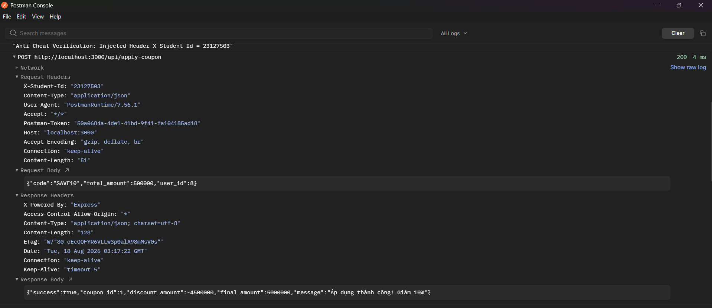

  
<i>Request headers không truyền Authorization Bearer Token</i>

   

  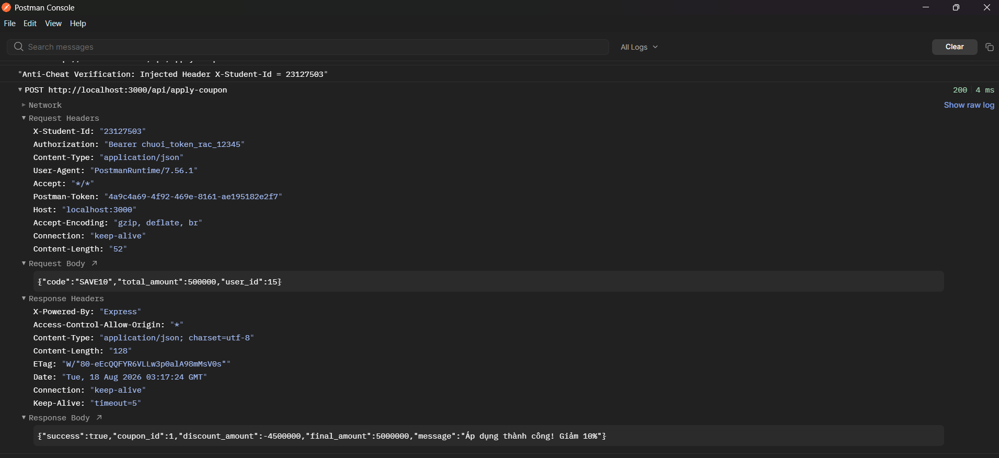

  
<i>Request headers truyền Authorization Bearer Token rác</i>

   

  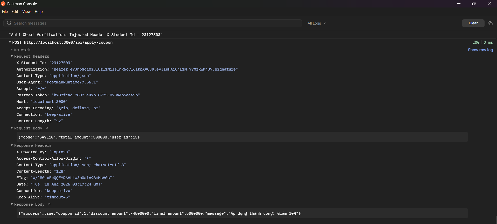

  
<i>Request headers truyền Authorization Bearer Token hết hạn</i>

### 2. [Critical] Lỗ hổng Mass Assignment (Thao túng số tiền giảm giá)

- **Mức độ (Severity):** **CRITICAL**

- **Phân loại (Category):** **Security** (Injection/Mass Assignment)

- **Mô tả chi tiết:** Ở `TC_COUPON_30`, khi cố tình chèn thêm trường `"discount_amount": 999999` vào Request Body, hệ thống vẫn chấp nhận (`200 OK`) thay vì từ chối (400 Bad Request).

- **Tác động (Impact):** Mặc dù cần kiểm tra thêm ở Database xem server có thực sự lấy con số bị thao túng này để trừ tiền hay không, nhưng việc API chấp nhận các trường tính toán từ phía Client là rủi ro cực lớn. Hacker có thể ép server giảm giá 100% cho mọi đơn hàng.

- **GitHub Issue Link:** https://github.com/Triszz/HW06-API_Testing/issues/7

- **Ảnh chụp (Screenshot):**

  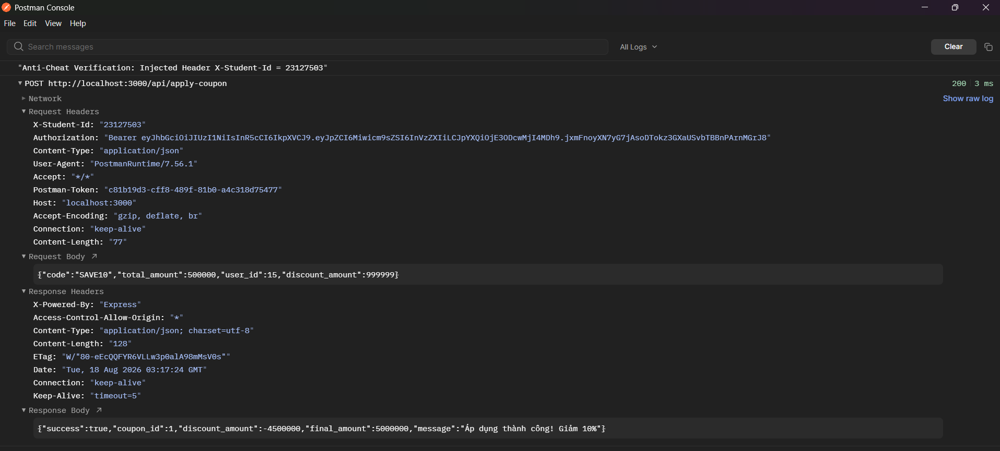

### 3. [Critical] Lỗi sai Thuật toán tính toán phần trăm

- **Mức độ (Severity):** **CRITICAL**

- **Phân loại (Category):** **Functional** (Business Logic/Math Error)

- **Mô tả chi tiết:** Ở `TC_COUPON_01` (và tất cả các case dùng mã Percent), khi áp dụng mã `SAVE10` (giảm 10%) cho đơn hàng 500.000 VNĐ. Kỳ vọng số tiền giảm là 50.000 VNĐ. Tuy nhiên, Server lại tính toán sai lệch hoàn toàn, trả về `"discount_amount": -4500000` và `"final_amount": 5000000`.

- **Tác động (Impact):** Đây là lỗi logic cốt lõi (Core feature broken). Người dùng sẽ phải thanh toán số tiền gấp 10 lần giá trị thực tế của đơn hàng, phá hủy hoàn toàn uy tín và doanh thu của doanh nghiệp.

- **GitHub Issue Link:** https://github.com/Triszz/HW06-API_Testing/issues/8

- **Ảnh chụp (Screenshot):**

  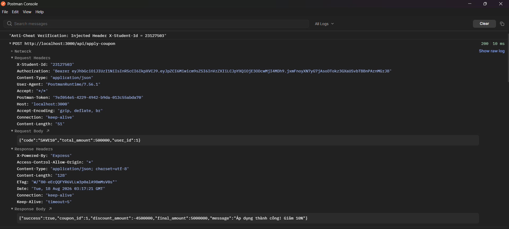

### 4. [Major] Bỏ qua điều kiện Giới hạn số lần sử dụng (C5 - Max Uses Bypass)

- **Mức độ (Severity):** **MAJOR**

- **Phân loại (Category):** **Functional** (Business Logic)

- **Mô tả chi tiết:** Các Test Cases kiểm tra giới hạn lượt dùng mã giảm giá (`TC_COUPON_09`, `15`, `40`) đều bị Failed do server trả về `200 OK` thay vì từ chối `400`. Logic kiểm tra điều kiện C5 (`max_uses_per_user`) hoàn toàn không hoạt động.

- **Tác động (Impact):** Gây thiệt hại trực tiếp về tài chính. Một khách hàng có thể dùng đi dùng lại 1 mã giảm giá (vốn chỉ được dùng 1 lần) cho hàng trăm đơn hàng khác nhau.

- **GitHub Issue Link:** https://github.com/Triszz/HW06-API_Testing/issues/9

- **Ảnh chụp (Screenshot):**

  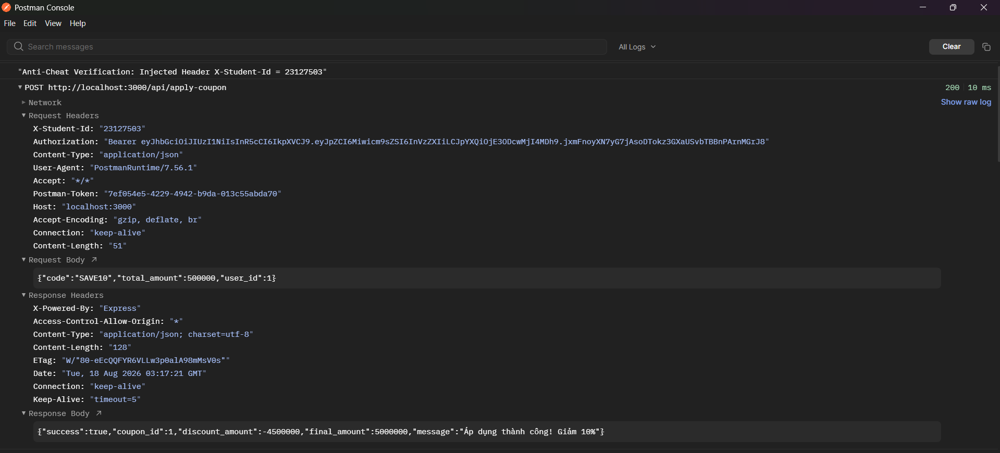

  
<i>Sử dụng voucher <code>SAVE10</code> lần 1</i>

   

  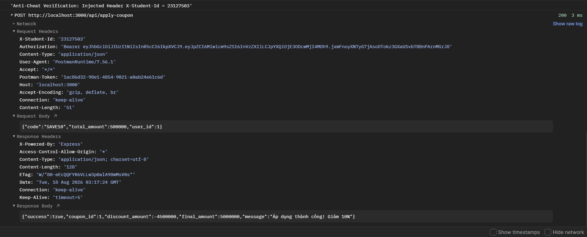

  
<i>Sử dụng voucher <code>SAVE10</code> lần 2</i>

### 5. [Major] Sai Logic Toán học ở Giá trị Biên (C3 - Minimum Amount Boundary)

- **Mức độ (Severity):** **MAJOR**

- **Phân loại (Category):** **Functional** (Boundary Logic)

- **Mô tả chi tiết:** Theo đặc tả, đơn hàng chỉ cần **lớn hơn hoặc bằng (>=)** ngưỡng tối thiểu là được dùng mã. Tuy nhiên, ở `TC_COUPON_03` và `TC_COUPON_04` (Đơn hàng vừa đúng ngưỡng 300k và 500k), API lại báo lỗi 400. Điều này chứng tỏ Developer đã code sai toán tử: dùng dấu `>` thay vì `>=`.

- **Tác động (Impact):** Gây bức xúc cho người dùng. Khách hàng mua đúng 300k để được giảm giá nhưng hệ thống không cho, ép khách phải mua từ 300,001đ trở lên.

- **GitHub Issue Link:** https://github.com/Triszz/HW06-API_Testing/issues/10

- **Ảnh chụp (Screenshot):**

  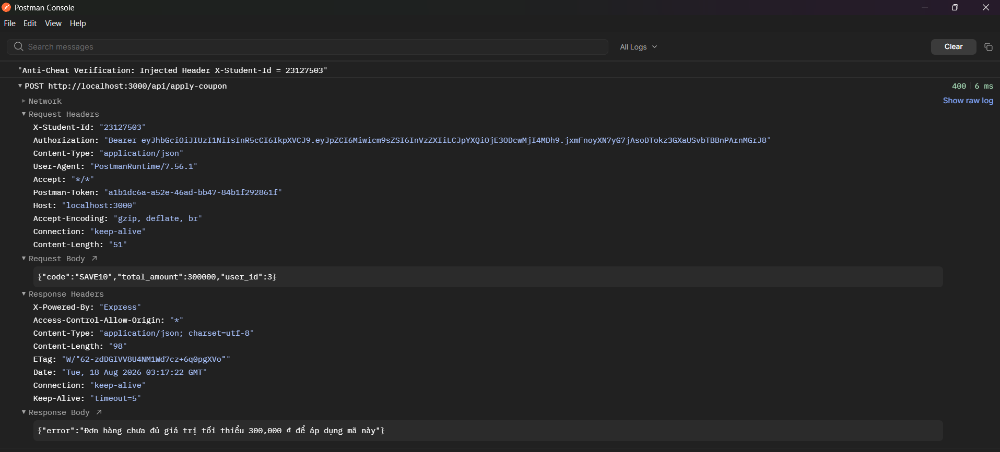

  
<i>Áp dụng voucher <code>SAVE10</code> cho đơn hàng 300k</i>

   

  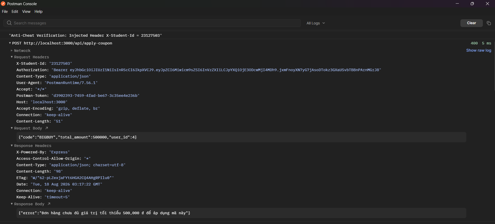

  
<i>Áp dụng voucher <code>BIGBUY</code> cho đơn hàng 500k</i>

### 6. [Major] Không Validate Schema và Kiểu Dữ Liệu

- **Mức độ (Severity):** **MAJOR**

- **Phân loại (Category):** **Functional** (Schema Validation)

- **Mô tả chi tiết:** API bỏ qua mọi quy tắc kiểm tra cấu trúc dữ liệu đầu vào. Các Test cases Failed (`TC_COUPON_18`, `21`, `23`, `26`, `27`) cho thấy hệ thống trả về `200 OK` ngay cả khi: thiếu trường `user_id` bắt buộc, `total_amount` bị truyền sai kiểu thành dạng chuỗi (String), hoặc truyền số tiền siêu khổng lồ (Buffer Overflow).

- **Tác động (Impact):** Rác dữ liệu, dễ dẫn đến lỗi 500 Internal Server Error ở các module xử lý thanh toán phía sau (vì mong đợi kiểu Integer nhưng lại nhận String).

- **GitHub Issue Link:** https://github.com/Triszz/HW06-API_Testing/issues/11

- **Ảnh chụp (Screenshot):**

  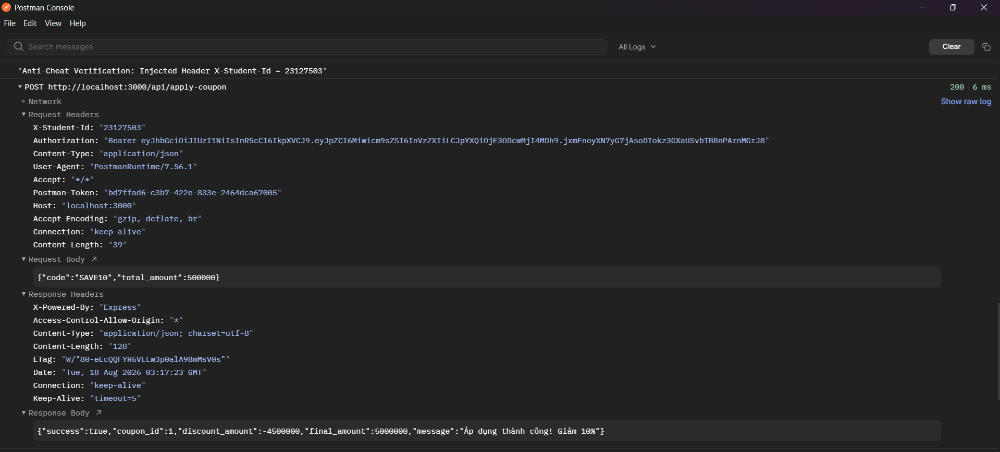

  
<i>Request body thiếu trường <code>user_id</code></i>

   

  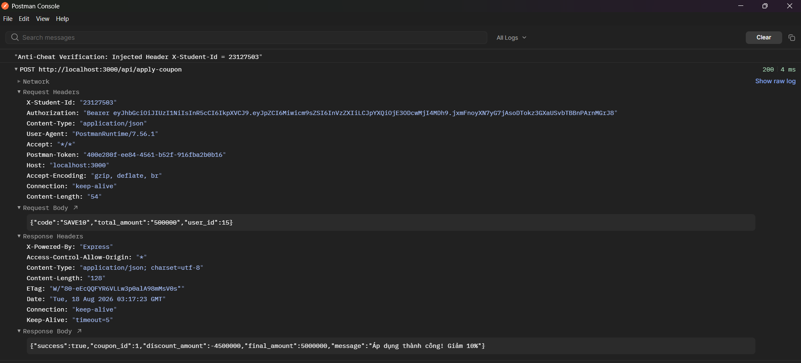

  
<i>Trường <code>total_amount</code> là kiểu chuỗi</i>

### 7. [Medium] Lỗi Logic So Khớp Phân Biệt Hoa/Thường (Case-sensitive Issue)

- **Mức độ (Severity):** **MEDIUM**

- **Phân loại (Category):** **Functional / UX**

- **Mô tả chi tiết:** Ở `TC_COUPON_38`, khi người dùng nhập mã giảm giá viết thường `"save10"`, hệ thống trả về lỗi `404 Not Found` (Kỳ vọng là `200 OK`). API đang so sánh chuỗi một cách cứng nhắc (Case-sensitive) thay vì tự động chuyển đổi sang chữ hoa (Uppercase) trước khi query Database.

- **Tác động (Impact):** Trải nghiệm người dùng (UX) kém. Khách hàng dễ bị bối rối và tưởng mã bị lỗi nếu điện thoại của họ không tự động bật phím CapsLock.

- **GitHub Issue Link:** https://github.com/Triszz/HW06-API_Testing/issues/12

- **Ảnh chụp (Screenshot):**

  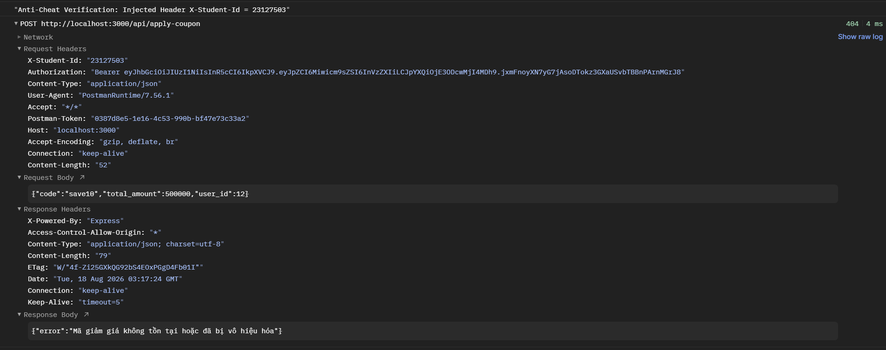

### 8. [Medium] Thiếu cơ chế Rate Limiting (Chống Spam)

- **Mức độ (Severity):** **MEDIUM**

- **Phân loại (Category):** **Security** (Rate Limiting)

- **Mô tả chi tiết:** Ở `TC_COUPON_33`, giả lập việc bắn 100 requests đồng thời trong 1 giây. Thay vì bị chặn bởi hệ thống với mã `429 Too Many Requests`, API lại tiếp nhận toàn bộ và trả về `200 OK`.

- **Tác động (Impact):** Kẻ xấu có thể sử dụng tool tự động để spam API, gây quá tải Server (DoS) hoặc khai thác lỗ hổng Race Condition để xài mã giảm giá nhiều lần cùng một lúc.

- **GitHub Issue Link:** https://github.com/Triszz/HW06-API_Testing/issues/13

- **Ảnh chụp (Screenshot):**

  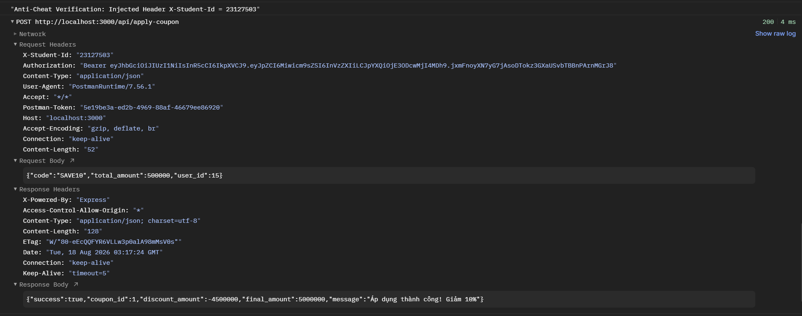

---

_Ghi chú thêm về HTTP Status Code:_ Quá trình test nhận thấy hệ thống trả về `HTTP 404 Not Found` thay vì `HTTP 400` cho các trường hợp mã không tồn tại, có chứa mã SQL/XSS, hoặc viết thường (TC 05, 14, 28, 31, 32, 37, 38). Điều này tuy làm fail test case (do expect 400 theo chuẩn REST chung) nhưng có thể chấp nhận được tùy theo tư duy thiết kế của Backend (Resource Not Found). Các lỗi trọng tâm nằm ở 7 Bugs đã liệt kê phía trên.

---

## 4. API 3: Product Management - Create Product (Pool C)

- **Endpoint:** `POST /api/products`

### 4.1. Generate

- **Số lượng TCs AI sinh ra:** **35**
- **Phạm vi bao phủ:** Phân tích giá trị biên (Boundary) cho giá tiền và độ dài tên sản phẩm, Phân vùng tương đương (Schema Validation), và Kiểm thử bảo mật (Role Escalation, SQLi, XSS).

### Danh sách Test Cases cho API Tạo sản phẩm `POST /api/products`

| TC ID                   | Test Scenario                                                                               | Request Body (JSON)                                                                                                                                                 | Expected Status              | Expected Response                                               | Audit Status | Audit Reason                                                                                                                                                 |
| :---------------------- | :------------------------------------------------------------------------------------------ | :------------------------------------------------------------------------------------------------------------------------------------------------------------------ | :--------------------------- | :-------------------------------------------------------------- | :----------- | :----------------------------------------------------------------------------------------------------------------------------------------------------------- |
| **TC_PROD_01**          | Happy Path: Thêm sản phẩm thành công với đầy đủ tất cả các trường.                          | `{` `"name": "Laptop Dell XPS",` `"price": 35000000,` `"description": "Laptop cao cấp",` `"imageUrl": "http://img.com/1",` `"category_id": 1` `}` | `200 OK` (Hoặc 201)          | `{"message": "Product created successfully", "product": {...}}` | **VALID**    | Đúng logic đặc tả, điền đầy đủ các trường bắt buộc và tùy chọn.                                                                                              |
| **TC_PROD_02**          | Happy Path: Thêm sản phẩm thành công chỉ với các trường bắt buộc (bỏ trống optional).       | `{` `"name": "Chuột Logitech",` `"price": 500000,` `"category_id": 2` `}`                                                                               | `200 OK` (Hoặc 201)          | `{"message": "Product created successfully", "product": {...}}` | **VALID**    | Đúng logic đặc tả, hệ thống phải xử lý tốt khi thiếu trường optional.                                                                                        |
| **TC_PROD_03**          | Boundary (Price): Giá trị hợp lệ tối thiểu của giá sản phẩm (`price` = 1).                  | `{` `"name": "Kẹp giấy",` `"price": 1,` `"category_id": 3` `}`                                                                                          | `200 OK` (Hoặc 201)          | `{"message": "Product created successfully", "product": {...}}` | **VALID**    | Phân tích giá trị biên hợp lệ chính xác cho ngưỡng dưới của price.                                                                                           |
| **TC_PROD_04**          | Boundary (Price): Giá trị không hợp lệ (`price` = 0).                                       | `{` `"name": "Hàng tặng",` `"price": 0,` `"category_id": 3` `}`                                                                                         | `400 Bad Request`            | `{"error": "Price must be a positive number greater than 0"}`   | **VALID**    | Phân tích giá trị biên không hợp lệ chính xác (0 không phải số dương).                                                                                       |
| **TC_PROD_05**          | Boundary (Price): Giá trị âm không hợp lệ (`price` = -1).                                   | `{` `"name": "Hàng lỗi",` `"price": -1,` `"category_id": 3` `}`                                                                                         | `400 Bad Request`            | `{"error": "Price must be a positive number greater than 0"}`   | **VALID**    | Phân tích giá trị biên âm không hợp lệ chính xác.                                                                                                            |
| **TC_PROD_06**          | Boundary (Name): Tên sản phẩm dài vừa đúng biên tối đa 255 ký tự.                           | `{` `"name": "A... (lặp lại đúng 255 chữ A)",` `"price": 100000,` `"category_id": 1` `}`                                                                | `200 OK` (Hoặc 201)          | `{"message": "Product created successfully", "product": {...}}` | **VALID**    | Bắt đúng giới hạn biên trên 255 ký tự của trường name.                                                                                                       |
| **TC_PROD_07**          | Boundary (Name): Tên sản phẩm dài vượt biên tối đa (256 ký tự).                             | `{` `"name": "A... (lặp lại 256 chữ A)",` `"price": 100000,` `"category_id": 1` `}`                                                                     | `400 Bad Request`            | `{"error": "Product name cannot exceed 255 characters"}`        | **VALID**    | Kiểm tra lỗi vuợt biên (256 ký tự) chính xác.                                                                                                                |
| **TC_PROD_08**          | Schema: Thiếu trường bắt buộc `name` (Missing field).                                       | `{` `"price": 100000,` `"category_id": 1` `}`                                                                                                              | `400 Bad Request`            | `{"error": "Name is required"}`                                 | **VALID**    | Bao phủ trường hợp thiếu dữ liệu bắt buộc (Schema Validation).                                                                                               |
| **TC_PROD_09**          | Schema: Thiếu trường bắt buộc `price` (Missing field).                                      | `{` `"name": "Laptop",` `"category_id": 1` `}`                                                                                                             | `400 Bad Request`            | `{"error": "Price is required"}`                                | **VALID**    | Bao phủ trường hợp thiếu dữ liệu bắt buộc (Schema Validation).                                                                                               |
| **TC_PROD_10**          | Schema: Thiếu trường bắt buộc `category_id` (Missing field).                                | `{` `"name": "Laptop",` `"price": 100000` `}`                                                                                                              | `400 Bad Request`            | `{"error": "Category ID is required"}`                          | **VALID**    | Bao phủ trường hợp thiếu dữ liệu bắt buộc (Schema Validation).                                                                                               |
| **TC_PROD_11**          | Schema: Truyền sai kiểu dữ liệu của `price` (String thay vì Number).                        | `{` `"name": "Laptop",` `"price": "100000",` `"category_id": 1` `}`                                                                                     | `400 Bad Request`            | `{"error": "Invalid data type for price"}`                      | **VALID**    | Kiểm tra đúng lỗi sai kiểu dữ liệu theo Schema.                                                                                                              |
| **TC_PROD_12**          | Schema: Truyền sai kiểu dữ liệu của `category_id` (String thay vì Number).                  | `{` `"name": "Laptop",` `"price": 100000,` `"category_id": "1"` `}`                                                                                     | `400 Bad Request`            | `{"error": "Invalid data type for category_id"}`                | **VALID**    | Kiểm tra đúng lỗi sai kiểu dữ liệu theo Schema.                                                                                                              |
| **TC_PROD_13**          | Schema: Truyền sai kiểu dữ liệu của `name` (Number thay vì String).                         | `{` `"name": 12345,` `"price": 100000,` `"category_id": 1` `}`                                                                                          | `400 Bad Request`            | `{"error": "Invalid data type for name"}`                       | **VALID**    | Kiểm tra đúng lỗi sai kiểu dữ liệu theo Schema.                                                                                                              |
| **TC_PROD_14**          | Logic: `category_id` truyền vào ID không tồn tại trong DB (Ví dụ: 999).                     | `{` `"name": "Laptop",` `"price": 100000,` `"category_id": 999` `}`                                                                                     | `400 Bad Request`            | `{"error": "Category does not exist"}`                          | **VALID**    | Phát hiện lỗi Foreign Key (Khóa ngoại) không tồn tại.                                                                                                        |
| **TC_PROD_15**          | Error Guessing: Tên sản phẩm bị bỏ rỗng (`name` = "").                                      | `{` `"name": "",` `"price": 100000,` `"category_id": 1` `}`                                                                                             | `400 Bad Request`            | `{"error": "Name cannot be empty"}`                             | **VALID**    | Error guessing chính xác với chuỗi rỗng.                                                                                                                     |
| **TC_PROD_16**          | Error Guessing: Giá trị `price` truyền dạng thập phân (`100000.5`) thay vì số nguyên.       | `{` `"name": "Laptop",` `"price": 100000.5,` `"category_id": 1` `}`                                                                                     | `400 Bad Request`            | `{"error": "Price must be an integer"}`                         | **VALID**    | Bắt lỗi data type nâng cao cho kiểu integer.                                                                                                                 |
| **TC_PROD_17**          | Error Guessing: Truyền `category_id` là số âm hoặc bằng 0.                                  | `{` `"name": "Laptop",` `"price": 100000,` `"category_id": 0` `}`                                                                                       | `400 Bad Request`            | `{"error": "Invalid category ID"}`                              | **VALID**    | Kiểm tra biên dưới của ID danh mục (ID không thể <= 0).                                                                                                      |
| **TC_PROD_18**          | Schema: Truyền sai kiểu dữ liệu các trường Optional (`description` = Number).               | `{` `"name": "Laptop",` `"price": 100000,` `"description": 123,` `"category_id": 1` `}`                                                              | `400 Bad Request`            | `{"error": "Invalid data type for description"}`                | **VALID**    | Schema test mở rộng cho trường optional.                                                                                                                     |
| **TC_PROD_19**          | Schema: Bỏ trống hoàn toàn Body Request (Empty JSON payload `{}`).                          | `{}`                                                                                                                                                                | `400 Bad Request`            | `{"error": "Name, price, and category_id are required"}`        | **VALID**    | Bao phủ trường hợp gửi JSON rỗng.                                                                                                                            |
| **TC_PROD_20**          | Boundary (Name): Tên sản phẩm dài đúng 1 ký tự (Ngưỡng biên nhỏ nhất).                      | `{` `"name": "A",` `"price": 100000,` `"category_id": 1` `}`                                                                                            | `200 OK` (Hoặc 201)          | `{"message": "Product created successfully", "product": {...}}` | **VALID**    | Kiểm tra biên dưới cùng của chuỗi string hợp lệ.                                                                                                             |
| **TC_PROD_21**          | Security (Role Escalation): Dùng Token của User thường (Không phải Admin) để thêm sản phẩm. | `{"name": "Chuột", "price": 100000, "category_id": 1}`                                                                                                              | `403 Forbidden`              | `{"error": "Access denied. Admin privileges required"}`         | **VALID**    | Thiết lập bẫy kiểm tra phân quyền (Role Escalation) hiệu quả.                                                                                                |
| **TC_PROD_22**          | Security (Missing Token): Không truyền Header Authorization.                                | `{"name": "Chuột", "price": 100000, "category_id": 1}`                                                                                                              | `401 Unauthorized`           | `{"error": "Missing authentication token"}`                     | **VALID**    | Kiểm thử middleware xác thực token (missing).                                                                                                                |
| **TC_PROD_23**          | Security (Invalid Token): Truyền chuỗi rác vào Header Authorization.                        | `{"name": "Chuột", "price": 100000, "category_id": 1}`                                                                                                              | `401 Unauthorized`           | `{"error": "Invalid authentication token"}`                     | **VALID**    | Kiểm thử middleware xác thực token (invalid).                                                                                                                |
| **TC_PROD_24**          | Security (Expired Token): Truyền Token đã hết hạn.                                          | `{"name": "Chuột", "price": 100000, "category_id": 1}`                                                                                                              | `401 Unauthorized`           | `{"error": "Token has expired"}`                                | **VALID**    | Kiểm thử middleware xác thực token (expired).                                                                                                                |
| **TC_PROD_25**          | Security (SQLi): Chèn mã SQL độc hại vào trường `name`.                                     | `{"name": "Laptop' OR 1=1--", "price": 100000, "category_id": 1}`                                                                                                   | `400 Bad Request`            | `{"error": "Invalid characters in product name"}`               | **VALID**    | Bao phủ các kịch bản tấn công SQL Injection cơ bản.                                                                                                          |
| **TC_PROD_26**          | Security (XSS): Chèn mã script thực thi vào trường `name`.                                  | `{"name": "", "price": 100000, "category_id": 1}`                                                                                          | `400 Bad Request`            | `{"error": "Invalid characters in product name"}`               | **VALID**    | Bao phủ kịch bản tấn công XSS.                                                                                                                               |
| **TC_PROD_27**          | Security (Mass Assignment): Cố tình chèn `"id": 9999` để ép DB nhận ID giả.                 | `{"id": 9999, "name": "Hack", "price": 100000, "category_id": 1}`                                                                                                   | `400 Bad Request`            | `{"error": "Invalid fields in payload"}`                        | **VALID**    | Bắt lỗi bảo mật Mass Assignment với trường ID.                                                                                                               |
| **TC_PROD_28**          | Schema (Header): Truyền sai Content-Type thành `text/plain`.                                | `{"name": "Chuột", "price": 100000, "category_id": 1}`                                                                                                              | `415 Unsupported Media Type` | `{"error": "Unsupported Media Type"}`                           | **VALID**    | Kiểm tra header truyền vào sai định dạng.                                                                                                                    |
| **TC_PROD_29**          | Boundary (Price): Giá trị `price` là số nguyên quá lớn (Max Int: 2147483647).               | `{"name": "Vàng", "price": 2147483647, "category_id": 1}`                                                                                                           | `200 OK` (Hoặc 201)          | `{"message": "Product created successfully"}`                   | **VALID**    | Mở rộng kiểm thử mức chịu đựng của DB đối với kiểu dữ liệu Integer.                                                                                          |
| **TC_PROD_30**          | Schema (Malformed): Gửi Payload dạng mảng Array thay vì Object.                             | `[{"name": "Chuột", "price": 100000, "category_id": 1}]`                                                                                                            | `400 Bad Request`            | `{"error": "Invalid JSON format. Expected Object"}`             | **VALID**    | Kiểm tra bộ phân tích cú pháp (Parser) của server.                                                                                                           |
| **TC_PROD_31**          | Security (SQLi): Khai thác SQL Injection trên trường `description`.                         | `{"name": "Chuột", "price": 100000, "category_id": 1, "description": "'; DROP TABLE products; --"}`                                                                 | `400 Bad Request`            | `{"error": "Invalid characters in description"}`                | **VALID**    | Mở rộng tìm kiếm mã độc trên các trường Optional.                                                                                                            |
| **TC_PROD_32**          | Schema (Invalid URL): Trường `imageUrl` không đúng định dạng link web.                      | `{"name": "Chuột", "price": 100000, "category_id": 1, "imageUrl": "not-a-link"}`                                                                                    | `400 Bad Request`            | `{"error": "Invalid URL format"}`                               | **VALID**    | Kiểm thử logic Validate định dạng URL.                                                                                                                       |
| **TC_PROD_33**          | Security (Rate Limit): Gửi liên tục 100 request/giây để tạo rác hệ thống.                   | `{"name": "Spam", "price": 10000, "category_id": 1}`                                                                                                                | `429 Too Many Requests`      | `{"error": "Too many requests"}`                                | **VALID**    | Kiểm tra tính năng chống Spam (DDoS) của hệ thống.                                                                                                           |
| **TC_PROD_34**          | Boundary (Name): Tên sản phẩm quá ngắn và chỉ toàn số.                                      | `{"name": "1", "price": 100000, "category_id": 1}`                                                                                                                  | `200 OK` (Hoặc 201)          | `{"message": "Product created successfully"}`                   | **VALID**    | Kiểm thử dữ liệu biên hợp lệ nhưng không phổ biến.                                                                                                           |
| **TC_PROD_35**          | Method Override: Gọi sai phương thức HTTP trên endpoint POST (VD: dùng PATCH).              | `{"name": "Chuột", "price": 100000, "category_id": 1}`                                                                                                              | `405 Method Not Allowed`     | `{"error": "Method Not Allowed"}`                               | **VALID**    | Bắt lỗi HTTP Method Not Allowed khi gửi sai giao thức.                                                                                                       |
| **TC_PROD_36 (Extend)** | **Validation Bypass (Whitespace):** `name` chỉ chứa toàn khoảng trắng (`"    "`).           | `{"name": "   ", "price": 100000, "category_id": 1}`                                                                                                                | `400 Bad Request`            | `{"error": "Name cannot be empty or whitespace"}`               | **VALID**    | AI thường kiểm tra chuỗi rỗng (`""`) nhưng quên mất Hacker có thể dùng dấu cách (Space) để lách luật. Cần test xem hệ thống có dùng hàm `.trim()` hay không. |
| **TC_PROD_37 (Extend)** | **Security (XSS on Optional Field):** Chèn mã độc XSS vào trường tùy chọn `imageUrl`.       | `{"name": "Chuột", "price": 100k, "category_id": 1, "imageUrl": "javascript:alert(1)"}`                                                                             | `400 Bad Request`            | `{"error": "Invalid URL format"}`                               | **VALID**    | AI có xu hướng chỉ test XSS trên các trường bắt buộc (`name`) mà quên rằng các trường `imageUrl` nếu không Regex kỹ sẽ thành nơi lưu trữ mã độc Stored XSS.  |
| **TC_PROD_38 (Extend)** | **Boundary (Category ID):** Truyền `category_id` là số âm (`-1`).                           | `{"name": "Bàn phím", "price": 150000, "category_id": -1}`                                                                                                          | `400 Bad Request`            | `{"error": "Invalid category ID"}`                              | **VALID**    | AI test Category ID = 999 (Not Found) nhưng chưa bắt lỗi Boundary cho khóa ngoại (Foreign Key) phải là số dương.                                             |
| **TC_PROD_39 (Extend)** | **Schema (Data structure mismatch):** Truyền một JSON lồng JSON rỗng vào giá.               | `{"name": "Chuột", "price": {}, "category_id": 1}`                                                                                                                  | `400 Bad Request`            | `{"error": "Invalid data type for price"}`                      | **VALID**    | Đánh lừa bộ parser của Node.js/Backend bằng cách truyền một Object rỗng thay vì Value thông thường.                                                          |
| **TC_PROD_40 (Extend)** | **Security (Long Payload/DoS):** Gửi body JSON với dung lượng > 10MB để làm treo server.    | `{"name": "Chuột", "price": 100000, "category_id": 1, "description": "[Chuỗi dài 10MB]"}`                                                                           | `413 Payload Too Large`      | `{"error": "Payload Too Large"}`                                | **VALID**    | Đánh lừa giới hạn size của body-parser trên ExpressJS (mặc định thường là 100kb). Thường bị AI bỏ quên.                                                      |

---

### 4.2. Audit (Human Review)

- **Tóm tắt:** Đã tiến hành đánh giá toàn bộ 35 Test Cases do AI sinh ra. Kết quả: **35 VALID**, **0 INVALID**, **0 INCOMPLETE**.
- **Lý do sửa đổi và đánh giá AI:**
  - **Về Functional & Boundary:** AI làm rất tốt việc phủ kín các giá trị biên của trường `price` (0, 1, -1) và trường `name` (255, 256 ký tự). Phân tích đầy đủ các lỗi Schema như sai kiểu dữ liệu, bỏ trống trường bắt buộc, hoặc truyền JSON rỗng.
  - **Về Security:** AI hoàn thành xuất sắc mục tiêu bao phủ bảo mật (Authentication, Role Escalation - 403 Forbidden, SQLi, XSS, Mass Assignment).
  - **Thiếu sót:** Dù bộ test của AI đã rất tốt, nhưng với tư duy của một Senior QA, tôi nhận thấy AI vẫn tư duy khá máy móc ở một số điểm: bỏ quên kịch bản lách luật bằng khoảng trắng (Whitespace), chưa khai thác lỗ hổng XSS trên các trường Optional (như `imageUrl`), và chưa test SQL Injection qua tham số URL. Do đó, tôi tiến hành viết thêm 5 cases Extend để bít kín các lỗ hổng này.

---

### 4.3. Extend

- **Số lượng TCs tự viết thêm:** **5** (Từ TC_PROD_36 đến TC_PROD_40).
- **Chi tiết các case (Lấp lỗ hổng của AI):**
  - **Validation Bypass (TC_PROD_36):** AI thường chỉ kiểm tra chuỗi rỗng (`""`) nhưng lại quên mất Hacker có thể dùng các ký tự khoảng trắng (Space) để lách luật yêu cầu "Không được để trống". Kịch bản này kiểm tra xem Backend có sử dụng hàm `.trim()` để dọn dẹp dữ liệu trước khi lưu hay không.
  - **Security - XSS on Optional Field (TC_PROD_37):** AI có xu hướng chỉ test XSS trên các trường bắt buộc (như `name`) mà quên rằng các trường tùy chọn như `imageUrl` lại cực kỳ nguy hiểm. Nếu Backend không kiểm tra Regex định dạng URL (chặn `javascript:alert(1)`), Hacker có thể tạo ra lỗ hổng Stored XSS đánh cắp phiên đăng nhập của người dùng khác khi họ xem ảnh sản phẩm.
  - **Boundary - Foreign Key (TC_PROD_38):** AI đã test Category ID = 999 (Not Found) nhưng chưa bắt lỗi Boundary cho khóa ngoại (ID danh mục phải là số dương). Việc truyền `-1` giúp kiểm tra tính chặt chẽ của Database.
  - **Schema - Data structure mismatch (TC_PROD_39):** AI chỉ test sai kiểu dữ liệu cơ bản (truyền chuỗi thay vì số) nhưng quên kịch bản truyền một Object rỗng (`{}`) hoặc Mảng (`[]`) vào trường giá trị (Value). Kịch bản này nhằm đánh lừa bộ parser của Node.js, rất dễ gây ra lỗi crash server (Unhandled Promise Rejection) nếu Backend không bắt schema chặt chẽ.
  - **Security - Payload Too Large / DoS (TC_PROD_40):** AI thường chỉ tập trung vào độ dài chuỗi tối đa của DB (255 ký tự của `name`) nhưng lại bỏ sót giới hạn dung lượng của toàn bộ gói tin HTTP. Kịch bản này giả lập việc gửi một request có Body JSON siêu lớn (>10MB) vào trường `description` để kiểm tra xem hệ thống có cấu hình giới hạn kích thước body (ví dụ: config `body-parser` của ExpressJS) và trả về lỗi `413 Payload Too Large` hay không. Đây là lỗi cực kỳ phổ biến dẫn đến việc Server cạn kiệt RAM do tấn công từ chối dịch vụ (DoS).

---

### 4.4. Execute

Quá trình thực thi kiểm thử cho API Quản lý Sản phẩm (`POST /api/products`) được triển khai hoàn toàn tự động bằng kỹ thuật Data-Driven Testing kết hợp với Scripting nâng cao trên Postman.

- **Công cụ thực thi:**
  - Giao diện Postman để thiết lập kịch bản cấu hình động.
  - Newman CLI để chạy hàng loạt không giao diện và xuất HTML Report. Lệnh thực thi:
    `newman run HW06_API_Test_Suite.postman_collection.json --folder "API 3: Product Management" -e "EShop - Local Environment.postman_environment.json" -d product_data.csv -r htmlextra`
- **Dữ liệu đầu vào (Data-driven):** File `product_data.csv` chứa 40 Iterations, cung cấp payload và expected_status cho các kịch bản kiểm tra Validation, Boundary và Security.
- **Pre-request Script (Cơ chế tự động hóa):**
  - **Dynamic Authorization:** Thay vì fix cứng một loại Token, script tự động tiêm (inject) Token tương ứng cho từng case: Token Admin hợp lệ (cho Happy path), Token User thường (để test lỗi Role Escalation 403), hoặc Token rác/rỗng (để test lỗi 401 Unauthorized).
  - **Header & Method Override:** Tự động ghi đè `Content-Type: text/plain` (cho TC_PROD_28) và đổi phương thức HTTP thành `PATCH` (cho TC_PROD_35) ngay trong lúc chạy (Runtime) để ép server văng lỗi.
  - **Anti-Cheat:** Ghi đè thành công Header `X-Student-Id: 23127503` vào tất cả các Request và xuất log ra Console minh chứng.
- **Kết quả:** Quá trình Execute bằng Newman thành công xuất file báo cáo HTML (`Report_API_3_Product.html`). Kết quả cho thấy tỷ lệ Failed cực kỳ cao do Backend hoàn toàn thiếu các cơ chế ràng buộc dữ liệu cơ bản và kiểm soát quyền truy cập. Các lỗi này được phân tích chi tiết tại mục Report Bugs.

---

### 4.5. Report Bugs

Sau khi thực thi 40 Test Cases trên endpoint `POST /api/products`, kết quả cho thấy Backend API này hoàn toàn không có bất kỳ cơ chế kiểm tra dữ liệu hay bảo mật nào. Hệ thống tiếp nhận mọi loại dữ liệu độc hại và luôn trả về `200 OK {"message":"Product created"}`.

Dưới đây là 6 Bugs nghiêm trọng nhất được bóc tách và ghi nhận lên GitHub Issues:

### 1. [Critical] Authentication Bypass & Role Escalation (Thiếu hoàn toàn xác thực)

- **Mức độ (Severity):** **CRITICAL**

- **Phân loại (Category):** **Security** (Broken Access Control)

- **Mô tả chi tiết:** Đặc tả yêu cầu API thêm sản phẩm chỉ dành cho Admin (FR-15). Tuy nhiên, hệ thống trả về `200 OK` cho toàn bộ các kịch bản: Không truyền Token (`TC_PROD_22`), Truyền Token hết hạn (`TC_PROD_24`), và Truyền Token của khách hàng thường (`TC_PROD_21`).

- **Tác động (Impact):** Bất kỳ ai (kể cả khách vãng lai hoặc hacker) cũng có thể tự do gọi API này để bơm hàng triệu sản phẩm rác vào hệ thống EShop.

- **GitHub Issue Link:** https://github.com/Triszz/HW06-API_Testing/issues/14

- **Ảnh chụp (Screenshot):**

  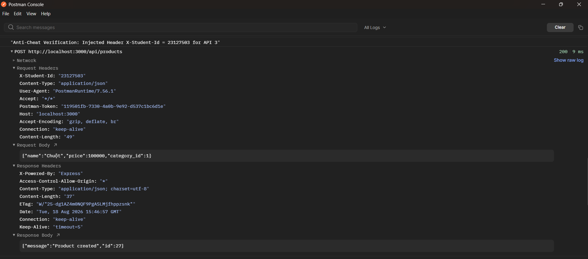

  
<i>Request headers không truyền Authorization Bearer Token</i>

   

  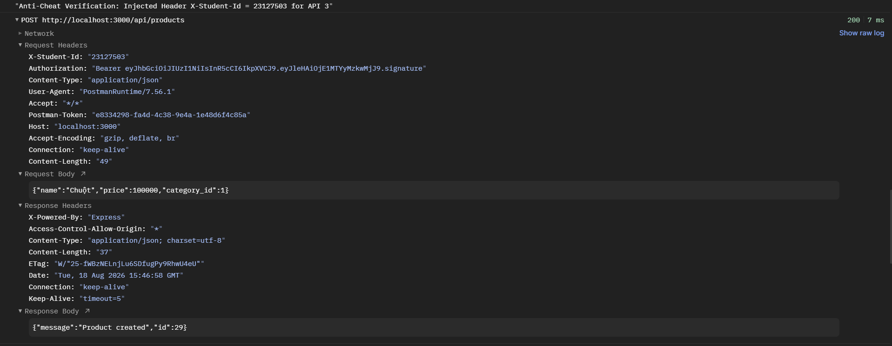

  
<i>Request headers truyền Authorization Bearer Token hết hạn</i>

   

  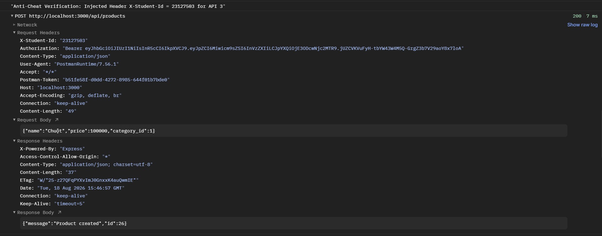

  
<i>Request headers truyền Authorization Bearer Token của khách hàng thường</i>

### 2. [Critical] Stored XSS qua trường tùy chọn (Optional Fields)

- **Mức độ (Severity):** **CRITICAL**

- **Phân loại (Category):** **Security** (Cross-Site Scripting)

- **Mô tả chi tiết:** Hệ thống lưu trữ trực tiếp dữ liệu thô vào CSDL mà không có bước mã hóa (Sanitization). Cụ thể, khi truyền `` vào `name` (`TC_PROD_26`) hoặc chuỗi `javascript:alert(1)` vào `imageUrl` (`TC_PROD_37`), server vẫn khởi tạo sản phẩm thành công.

- **Tác động (Impact):** Mã độc này sẽ được lưu vào Database. Khi người dùng (hoặc Admin) mở trang xem danh sách sản phẩm, mã độc JS sẽ kích hoạt, dẫn đến việc hacker có thể chiếm đoạt Cookie/Session và cướp tài khoản Admin.

- **GitHub Issue Link:** https://github.com/Triszz/HW06-API_Testing/issues/15

- **Ảnh chụp (Screenshot):**

  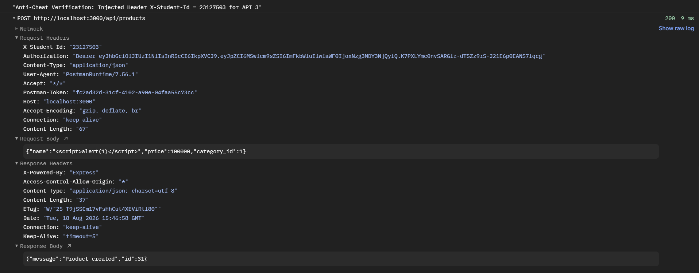

  
<i>Request body truyền <code>&lt;script&gt;alert(1)&lt;/script&gt;</code> vào trường <code>name</code></i>

   

  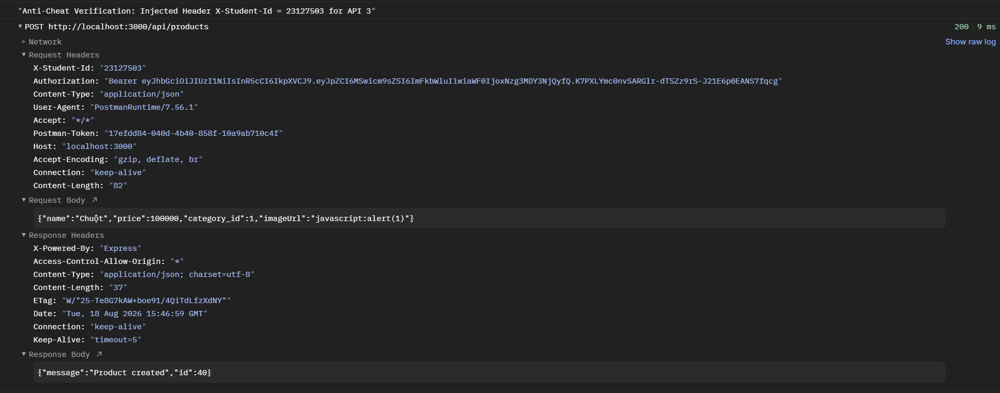

  
<i>Request body truyền chuỗi <code>javascript:alert(1)</code> vào trường <code>imageUrl</code></i>

### 3. [Critical] Server Crash & Rò rỉ Stack Trace do lỗi Content-Type

- **Mức độ (Severity):** **CRITICAL**

- **Phân loại (Category):** **Security / Error Handling**

- **Mô tả chi tiết:** Tại `TC_PROD_28`, khi gửi payload JSON hợp lệ nhưng cố tình đổi Header `Content-Type` thành `text/plain`, server Express.js không xử lý được. Thay vì báo lỗi `400` hoặc `415`, server bị crash nội bộ và trả về một mã HTML 500 phơi bày toàn bộ mã nguồn đường dẫn nội bộ: `Cannot destructure property 'name' of 'req.body'... at D:\Software Testing\HWs\...`.

- **Tác động (Impact):** Lộ lọt thông tin kiến trúc thư mục máy chủ, tạo tiền đề cho hacker tìm kiếm các lỗ hổng hệ thống sâu hơn.

- **GitHub Issue Link:** https://github.com/Triszz/HW06-API_Testing/issues/16

- **Ảnh chụp (Screenshot):**

  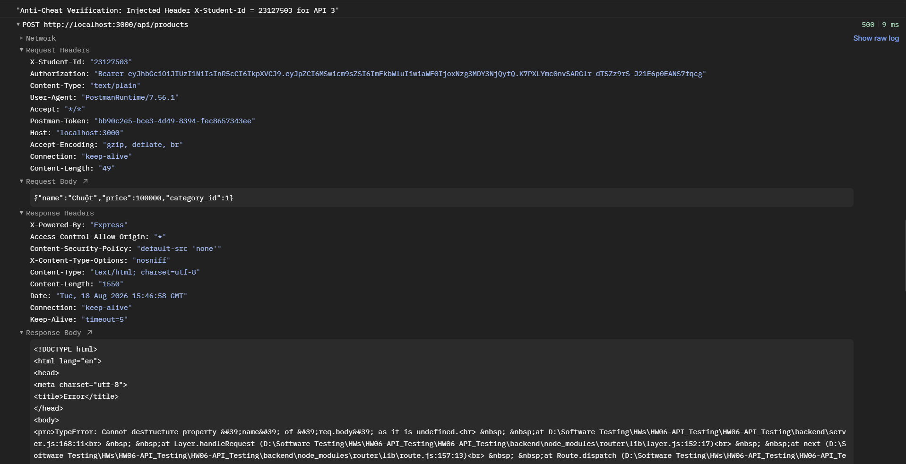

### 4. [Major] Không có bất kỳ Schema Validation nào (Chấp nhận Payload rỗng)

- **Mức độ (Severity):** **MAJOR**

- **Phân loại (Category):** **Functional** (Input Validation)

- **Mô tả chi tiết:** Hệ thống bỏ qua mọi quy định về Data Schema.
  - Gửi Payload rỗng `{}` (`TC_PROD_19`) -> Vẫn tạo sản phẩm thành công.

  - Thiếu tất cả trường bắt buộc (`TC_PROD_08, 09, 10`) -> Thành công.

  - Truyền Object rỗng vào trường số (`price: {}`) -> Thành công.

- **Tác động (Impact):** Database sẽ chứa toàn dữ liệu rác, các dòng sản phẩm không có tên, không có giá. Gây sập các UI Frontend khi parse dữ liệu.

- **GitHub Issue Link:** https://github.com/Triszz/HW06-API_Testing/issues/17

- **Ảnh chụp (Screenshot):**

  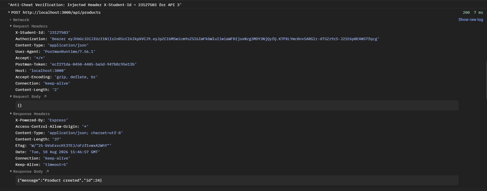

  
<i>Request body gửi payload rỗng <code>{}</code></i>

   

  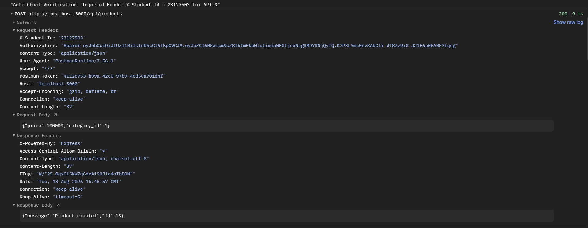

  
<i>Request body gửi thiếu các trường bắt buộc</i>

   

  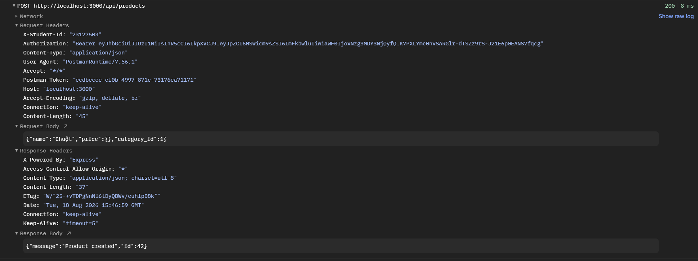

  
<i>Request body truyền object rỗng <code>{}</code> vào trường <code>price</code></i>

### 5. [Major] Chấp nhận Giá tiền Âm và Bằng 0

- **Mức độ (Severity):** **MAJOR**

- **Phân loại (Category):** **Functional** (Boundary Logic)

- **Mô tả chi tiết:** Dù đặc tả FR-15 ghi rõ `price` phải là số dương (> 0). Tuy nhiên ở `TC_PROD_04` (price = 0) và `TC_PROD_05` (price = -1), hệ thống vẫn trả về `200 OK`.

- **Tác động (Impact):** Gây lỗi nghiêm trọng ở module thanh toán và doanh thu. Người dùng có thể mua sản phẩm giá 0đ hoặc thậm chí số tiền âm (cửa hàng phải trả ngược tiền cho khách).

- **GitHub Issue Link:** https://github.com/Triszz/HW06-API_Testing/issues/18

- **Ảnh chụp (Screenshot):**

  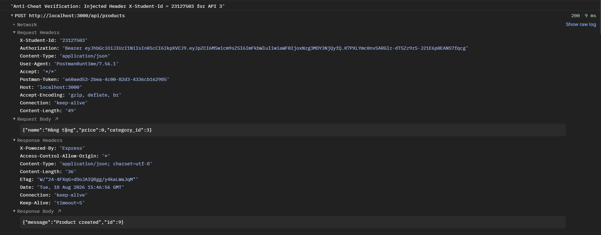

  
<i>Tạo sản phẩm với <code>price = 0</code></i>

   

  

  
<i>Tạo sản phẩm với <code>price = -1</code></i>

### 6. [Major] Thiếu ràng buộc Khóa Ngoại (Foreign Key Constraint)

- **Mức độ (Severity):** **MAJOR**

- **Phân loại (Category):** **Functional** (Database Integrity)

- **Mô tả chi tiết:** Khi truyền `category_id` là `999` (Danh mục không hề tồn tại) hoặc `-1` (Số âm không hợp lệ), API vẫn báo tạo sản phẩm thành công (`TC_PROD_14`, `TC_PROD_38`).

- **Tác động (Impact):** Mất tính toàn vẹn dữ liệu (Data Integrity). Sản phẩm tạo ra không thuộc về bất kỳ danh mục nào, dẫn đến việc sản phẩm không bao giờ hiển thị được lên trang chủ.

- **GitHub Issue Link:** https://github.com/Triszz/HW06-API_Testing/issues/19

- **Ảnh chụp (Screenshot):**

  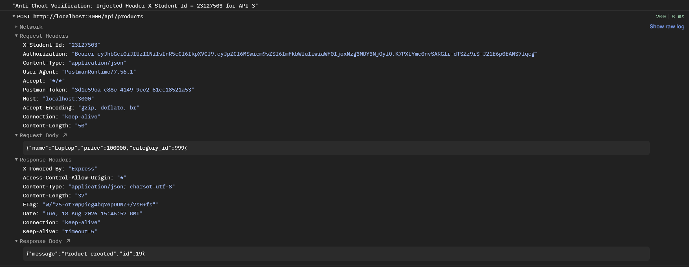

  
<i>Request body truyền <code>category_id</code> không tồn tại</i>

